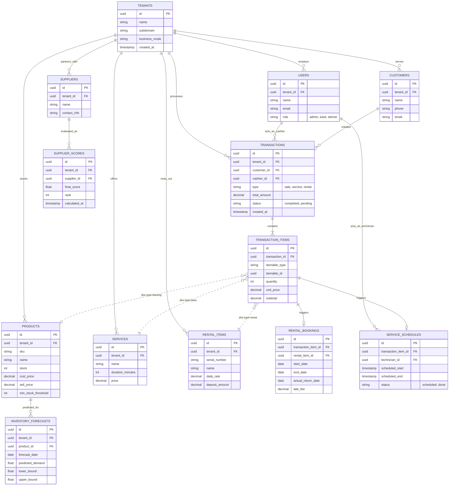

# Database Architecture & ERD

# WebifyLab Posky — Database Architecture & ERD

## 1. Strategi Database: Shared Schema Multi-Tenancy

Untuk menyeimbangkan antara kemudahan *maintenance*, biaya infrastruktur, dan kecepatan *development* (timeline 8 minggu), kita menggunakan pendekatan **Single Database, Shared Schema**.

- **Isolasi Data:** Setiap tabel transaksional dan master data (kecuali tabel sistem global) wajib memiliki kolom `tenant_id` (UUID).
- **Enforcement:** Isolasi dilakukan di level aplikasi menggunakan **Laravel Global Scopes**. Setiap *query* ORM akan otomatis menyuntikkan `WHERE tenant_id = '...'`, mencegah kebocoran data lintas tenant (*cross-tenant data leakage*).
- **Soft Deletes:** Semua tabel master dan transaksional menggunakan `deleted_at` untuk memudahkan audit dan pemulihan data yang tidak sengaja dihapus oleh kasir.

## 2. Entity Relationship Diagram (ERD)

*Catatan: Relasi antara `TRANSACTION_ITEMS` dengan `PRODUCTS`, `SERVICES`, dan `RENTAL_ITEMS` diimplementasikan menggunakan **Polymorphic Relationship** di Laravel (`itemable_type` dan `itemable_id`).*



## 3. Detail Tabel & Implementasi Laravel

### A. Core & Master Data

| Nama Tabel | Deskripsi & Catatan Implementasi |
| --- | --- |
| `tenants` | Tabel utama SaaS. Berisi info billing, subdomain, dan konfigurasi global tenant. |
| `users` | Menggunakan Laravel Sanctum. Kolom `role` menggunakan Enum (`admin`, `kasir`, `teknisi`, `manajer`). |
| `customers` | Database pelanggan untuk keperluan RFM Analysis dan Cohort Analytics. |

### B. Katalog Multi-Mode

| Nama Tabel | Deskripsi & Catatan Implementasi |
| --- | --- |
| `products` | Khusus Mode Barang. Memiliki logika stok. Kolom `min_stock_threshold` digunakan sebagai trigger peringatan stok menipis. |
| `services` | Khusus Mode Jasa. Tidak memiliki stok, melainkan `duration_minutes` untuk penjadwalan teknisi. |
| `rental_items` | Khusus Mode Persewaan. Memiliki `serial_number` (karena item sewa bersifat unik/fisik, bukan stok massal) dan `deposit_amount`. |

### C. Transaksi & Operasional

| Nama Tabel | Deskripsi & Catatan Implementasi |
| --- | --- |
| `transactions` | Header transaksi. Menyimpan total akhir, pajak, dan diskon. |
| `transaction_items` | Detail transaksi. Menggunakan **Polymorphic Relation** (`itemable_type`, `itemable_id`) agar satu tabel bisa merujuk ke `Product`, `Service`, atau `RentalItem`. |
| `rental_bookings` | Tabel pendukung untuk menghitung denda keterlambatan (*late fee*) secara otomatis berdasarkan `actual_return_date` vs `end_date`. |
| `service_schedules` | Tabel pendukung untuk mencegah *double-booking* teknisi pada jam yang sama. |

### D. AI & Decision Support System

| Nama Tabel | Deskripsi & Catatan Implementasi |
| --- | --- |
| `suppliers` | Data vendor/supplier. |
| `supplier_scores` | Output dari **Python AHP Engine**. Disimpan sebagai *cache* hasil komputasi agar UI tidak perlu menghitung ulang matriks AHP setiap kali halaman dibuka. |
| `inventory_forecasts` | Output dari **Python Prophet**. Berisi prediksi permintaan (demand) beserta *confidence interval* (`lower_bound`, `upper_bound`). |

## 4. Strategi Indexing & Optimasi Performa

Mengingat ini adalah SaaS Multi-Tenant, query yang tidak ter-index dengan benar akan menyebabkan *full table scan* yang membunuh performa server seiring bertambahnya data.

**Wajib diterapkan (Composite Indexes):**

1. **Aturan Emas Multi-Tenant:** Setiap tabel yang memiliki `tenant_id` **WAJIB** memiliki index composite `(tenant_id, id)` atau `(tenant_id, created_at)`.
    
    ```sql
    CREATE INDEX idx_transactions_tenant_date ON transactions(tenant_id, created_at);
    CREATE INDEX idx_products_tenant_stock ON products(tenant_id, stock);
    ```
    
2. **Polymorphic Indexing:** Untuk `transaction_items`, buat index pada `itemable_type` dan `itemable_id`.
    
    ```sql
    CREATE INDEX idx_trans_items_polymorphic ON transaction_items(itemable_type, itemable_id);
    ```
    
3. **Analytics & AI Queries:**
    
    ```sql
    -- Mempercepat query RFM (Recency, Frequency, Monetary)
    CREATE INDEX idx_customers_tenant_rfm ON customers(tenant_id, id, created_at);
    -- Mempercepat pengambilan data historis untuk Prophet
    CREATE INDEX idx_trans_items_product_hist ON transaction_items(itemable_id, created_at) WHERE itemable_type = 'App\\Models\\Product';
    ```
    

## 5. Aturan Keamanan & Integritas Data

1. **Foreign Key Constraints:** Selalu gunakan `ON DELETE CASCADE` untuk tabel anak yang bersifat detail (misal: `transaction_items` dihapus jika `transaction` dihapus). Namun, gunakan `ON DELETE RESTRICT` untuk master data (misal: `products` tidak boleh dihapus jika sudah ada di `transaction_items`, cukup gunakan *Soft Delete*).
2. **Pencegahan Cross-Tenant:** Di level Database, pertimbangkan untuk menggunakan PostgreSQL **Row Level Security (RLS)** di masa depan sebagai lapisan keamanan kedua jika terjadi *bug* di Laravel Global Scope.