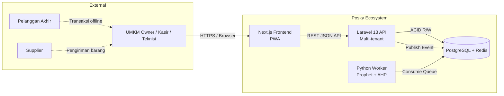

# Software Requirements Specification
## For Webifylab - POSKY

Version 1.0
Prepared by Rizal Rio Andrian 
Webifylab
22 Agustus 2026

---

## Table of Contents

- [1. Introduction](#1-introduction)
  - [1.1 Document Purpose](#11-document-purpose)
  - [1.2 Product Scope](#12-product-scope)
  - [1.3 Definitions, Acronyms, and Abbreviations](#13-definitions-acronyms-and-abbreviations)
  - [1.4 References](#14-references)
  - [1.5 Document Overview](#15-document-overview)
- [2. Product Overview](#2-product-overview)
- [3. Requirements](#3-requirements)
- [4. Verification](#4-verification)
- [5. Appendixes](#5-appendixes)

---

# 1. Introduction

Dokumen ini merupakan **Software Requirements Specification (SRS)** untuk **WebifyLab Posky** — sebuah platform SaaS kasir multi-tenant berbasis AI yang dirancang khusus untuk UMKM dengan model bisnis hybrid (Barang, Jasa, dan Persewaan). SRS ini mendefinisikan **apa** yang harus dilakukan sistem (behavior, kualitas, dan constraint), bukan **bagaimana** sistem diimplementasikan. Detail implementasi teknis dapat ditemukan pada dokumen pendamping seperti *System Architecture Document (SAD)* dan *Design System*.

SRS ini ditujukan untuk **product manager, software engineer, QA engineer, system analyst, dan stakeholder teknis** sebagai *single source of truth* selama siklus pengembangan, verifikasi, dan pemeliharaan sistem.

## 1.1 Document Purpose

SRS ini disusun untuk:

1. Mendefinisikan kebutuhan fungsional dan non-fungsional sistem Posky secara terstruktur, terukur, dan dapat diverifikasi.
2. Menjadi acuan bersama antara tim produk, engineering, QA, dan stakeholder dalam proses pengembangan, testing, dan validasi.
3. Menjamin bahwa setiap requirement memiliki **ID unik**, **acceptance criteria** yang jelas, dan **metode verifikasi** yang terdefinisi.
4. Mendukung traceability penuh dari requirement → design → implementation → test artifact.

**Audiens utama:**
- **Product Manager / Business Analyst** — untuk memvalidasi scope dan prioritas fitur.
- **Software Engineer (Frontend, Backend, AI/ML)** — sebagai acuan implementasi.
- **QA Engineer** — sebagai dasar penyusunan test case dan acceptance test.
- **System Analyst** — untuk verifikasi kelengkapan dan konsistensi requirement.

## 1.2 Product Scope

**WebifyLab Posky** (versi 1.0) adalah platform **Software-as-a-Service (SaaS) multi-tenant** yang menyatukan manajemen operasional tiga mode bisnis — **Barang (retail/inventory), Jasa (booking/teknisi), dan Persewaan (rental/deposit)** — dalam satu dashboard terpadu. Sistem ini diperkuat oleh kemampuan **AI/ML** berupa prediksi stok (*stockout forecasting*) menggunakan algoritma **Prophet** dan rekomendasi supplier objektif menggunakan metode **Analytic Hierarchy Process (AHP)**.

**Tujuan utama:**
- Menghilangkan kebutuhan UMKM untuk menggunakan 2–3 aplikasi terpisah saat menjalankan model bisnis hybrid.
- Memberikan kemampuan *decision-making* setara enterprise (forecasting, supplier scoring, RFM analysis) dengan biaya operasional yang terjangkau untuk UMKM.
- Mencapai *time-to-market* 8 minggu dengan arsitektur yang pragmatis namun scalable.

**Inclusions (dalam scope SRS ini):**
- Multi-tenant POS dengan 3 mode bisnis (Barang, Jasa, Persewaan).
- Manajemen produk, jasa, item sewa, pelanggan, dan supplier.
- Transaksi universal (checkout) dengan dukungan polymorphic items.
- AHP-based supplier recommendation engine.
- Stockout prediction dashboard berbasis Prophet.
- Universal analytics: RFM segmentation & Cohort analysis.
- Role-based access control (Admin, Manajer, Kasir, Teknisi).
- Responsive web application (PWA-ready).

**Exclusions (di luar scope SRS ini):**
- ❌ Native mobile app (iOS/Android) — fokus pada responsive web.
- ❌ Integrasi payment gateway real-time (Midtrans/Xendit) — menggunakan simulasi pembayaran.
- ❌ Real-time IoT GPS tracking untuk item persewaan.
- ❌ Multi-bahasa (i18n) — versi awal hanya Bahasa Indonesia.
- ❌ Multi-currency — hanya Rupiah (IDR).
- ❌ Fitur akuntansi lengkap (jurnal, neraca, laba-rugi) — hanya pencatatan transaksi dasar.

## 1.3 Definitions, Acronyms, and Abbreviations

| Term | Definition |
|---|---|
| **AHP** | *Analytic Hierarchy Process* — metode pengambilan keputusan multi-kriteria yang dikembangkan oleh T.L. Saaty, digunakan untuk scoring dan ranking supplier. |
| **API** | *Application Programming Interface* — antarmuka pemrograman untuk integrasi antar sistem. |
| **Cohort Analysis** | Teknik analitik yang mengelompokkan pelanggan berdasarkan periode pertama kali bertransaksi untuk mengukur retensi. |
| **CRUD** | *Create, Read, Update, Delete* — empat operasi dasar pada data persisten. |
| **Dashboard** | Antarmuka visual yang menyajikan ringkasan data dan metrik bisnis secara real-time. |
| **Deposit** | Uang jaminan yang dibayarkan penyewa saat mengambil item persewaan, dapat dikurangi oleh denda keterlambatan atau kerusakan. |
| **ERD** | *Entity Relationship Diagram* — diagram yang menggambarkan relasi antar entitas dalam database. |
| **Forecasting** | Proses prediksi nilai masa depan berdasarkan data historis, dalam konteks ini menggunakan algoritma Prophet. |
| **Global Scope** | Fitur Laravel yang secara otomatis menyuntikkan filter `tenant_id` ke setiap query ORM untuk menjamin isolasi data multi-tenant. |
| **Hybrid Mode** | Mode bisnis tenant yang mengaktifkan lebih dari satu mode (Barang+Jasa, Barang+Persewaan, atau ketiganya). |
| **Late Fee** | Denda yang dikenakan ketika penyewa mengembalikan item melewati tanggal jatuh tempo. |
| **MAPE** | *Mean Absolute Percentage Error* — metrik akurasi model forecasting (target: >85% akurasi). |
| **Mode Barang** | Mode bisnis untuk retail/inventory — fokus pada penjualan produk fisik dengan manajemen stok. |
| **Mode Jasa** | Mode bisnis untuk layanan — fokus pada booking teknisi dengan penjadwalan slot waktu. |
| **Mode Persewaan** | Mode bisnis untuk rental — fokus pada peminjaman aset fisik dengan deposit dan durasi sewa. |
| **Multi-Tenant** | Arsitektur SaaS di mana satu instance aplikasi melayani banyak pelanggan (tenant) dengan isolasi data yang ketat. |
| **NFR** | *Non-Functional Requirement* — kebutuhan yang mendefinisikan kualitas sistem (performa, keamanan, ketersediaan). |
| **POS** | *Point of Sale* — sistem kasir untuk memproses transaksi penjualan. |
| **Polymorphic Relation** | Relasi database di mana satu tabel dapat merujuk ke beberapa tipe entitas (dalam Posky: `transaction_items` dapat merujuk ke `Product`, `Service`, atau `RentalItem`). |
| **Prophet** | Library time-series forecasting open-source dari Facebook/Meta, digunakan untuk prediksi permintaan stok. |
| **PWA** | *Progressive Web App* — aplikasi web yang dapat diinstal dan berjalan seperti aplikasi native. |
| **RFM** | *Recency, Frequency, Monetary* — metode segmentasi pelanggan berdasarkan kedekatan transaksi terakhir, frekuensi, dan nilai belanja. |
| **SaaS** | *Software as a Service* — model pengiriman perangkat lunak melalui internet dengan berlangganan. |
| **SKU** | *Stock Keeping Unit* — kode unik untuk identifikasi produk dalam inventori. |
| **Soft Delete** | Teknik penghapusan data dengan menandai kolom `deleted_at` alih-alih menghapus baris secara fisik, memungkinkan pemulihan data. |
| **SRS** | *Software Requirements Specification* — dokumen spesifikasi kebutuhan perangkat lunak. |
| **Tenant** | Satu unit bisnis/UMKM yang menyewa platform Posky; memiliki data terisolasi dari tenant lain. |
| **UI** | *User Interface* — antarmuka visual tempat pengguna berinteraksi dengan sistem. |
| **UUID** | *Universally Unique Identifier* — identifier 128-bit yang digunakan sebagai primary key untuk menghindari konflik data antar tenant. |

## 1.4 References

Dokumen berikut menjadi rujukan normative dan informative untuk SRS ini:

### Internal Documents (Normative)

| ID | Title | Version | Date | Location | Type |
|---|---|---|---|---|---|
| [INT-01] | Project Blueprint — WebifyLab Posky | 1.0 | 2026 | `BLUEPRINT.md` | Normative |
| [INT-02] | System Architecture Document (SAD) | 1.0 | 2026 | `ARCHITECTURE.md` | Normative |
| [INT-03] | Design System & UI Guidelines | 1.0 | 2026-08-05 | `DESIGN.md` | Normative |
| [INT-04] | API Endpoint Documentation | 1.0 | 2026-01-29 | `API.md` | Normative |
| [INT-05] | Database Architecture & ERD | 1.0 | 2026 | `DATABASE.md` | Normative |

### External Standards (Normative)

| ID | Title | Author | Type |
|---|---|---|---|
| [EXT-01] | IEEE 830 — Recommended Practice for Software Requirements Specifications | IEEE | Standard |
| [EXT-02] | ISO/IEC/IEEE 29148:2018 — Systems and software engineering — Life cycle processes — Requirements engineering | ISO/IEC/IEEE | Standard |
| [EXT-03] | WCAG 2.1 — Web Content Accessibility Guidelines | W3C | Standard |
| [EXT-04] | UU No. 27 Tahun 2022 tentang Perlindungan Data Pribadi (UU PDP) | Pemerintah RI | Regulation |

### Informative References

| ID | Title | Author | URL |
|---|---|---|---|
| [INF-01] | Laravel Multi-Tenancy Documentation | Stancl | https://tenancyforlaravel.com/ |
| [INF-02] | Prophet: Forecasting at Scale | Facebook/Meta | https://facebook.github.io/prophet/ |
| [INF-03] | The Analytic Hierarchy Process | T.L. Saaty | Wikipedia / McGraw-Hill |
| [INF-04] | dbt (data build tool) Documentation | dbt Labs | https://docs.getdbt.com/ |
| [INF-05] | Shadcn UI Documentation | shadcn | https://ui.shadcn.com/ |

## 1.5 Document Overview

SRS ini disusun mengikuti struktur **IEEE 830** dan **ISO/IEC/IEEE 29148**, dengan tambahan section modern untuk **AI/ML** dan **Observability**. Struktur dokumen:

- **Section 1 — Introduction** (dokumen ini): Tujuan, scope, glossary, referensi, dan navigasi dokumen.
- **Section 2 — Product Overview**: Konteks produk, fungsi utama, constraint, karakteristik pengguna, asumsi, dan alokasi requirement.
- **Section 3 — Requirements**: Kebutuhan detail yang dapat diverifikasi, mencakup:
  - **3.1 External Interfaces** — UI, hardware, software interfaces.
  - **3.2 Functional Requirements** — perilaku sistem yang dapat diamati dari luar.
  - **3.3 Quality of Service** — performa, keamanan, reliabilitas, ketersediaan, observabilitas.
  - **3.4 Compliance** — kewajiban regulasi dan kontrak.
  - **3.5 Design & Implementation** — constraint teknis (instalasi, build, distribusi, maintainability).
  - **3.6 AI/ML** — requirement khusus untuk komponen machine learning.
- **Section 4 — Verification**: Metode verifikasi dan traceability matrix.
- **Section 5 — Appendixes**: Materi pendukung non-normative (diagram, contoh data, dll).

**Konvensi penulisan:**
- Setiap requirement memiliki **ID unik** dengan format `REQ-[AREA]-[NNN]` (contoh: `REQ-POS-001`, `REQ-AI-003`).
- Kata kunci **RFC 2119** digunakan secara konsisten:
  - **SHALL** (wajib) — requirement mengikat.
  - **SHOULD** (dianjurkan) — requirement penting namun ada pengecualian terjustifikasi.
  - **MAY** (opsional) — requirement pilihan.
- Bahasa dokumen: **Bahasa Indonesia**, dengan istilah teknis dalam Bahasa Inggris dipertahankan (contoh: *multi-tenant*, *forecasting*, *checkout*).
- Dokumen dikelola dalam **Markdown** di repository Git, dengan revision history terpelihara di header dokumen.

---

## 2. Product Overview

Bagian ini memberikan konteks bisnis, teknis, dan operasional yang melatarbelakangi kebutuhan sistem Posky. Informasi di sini menjadi fondasi bagi requirement detail di Section 3.

### 2.1 Product Perspective

**WebifyLab Posky** adalah produk **baru (greenfield)** yang dikembangkan oleh **WebifyLab** sebagai platform SaaS kasir multi-tenant generasi pertama. Produk ini **bukan** pengganti sistem existing, melainkan solusi baru yang ditujukan untuk mengisi kekosongan di pasar POS UMKM Indonesia — khususnya untuk UMKM dengan model bisnis hybrid yang saat ini terpaksa menggunakan 2–3 aplikasi terpisah.

**Posisi dalam ekosistem:**

**Hubungan dengan sistem eksternal:**
- **Tidak ada** integrasi langsung dengan sistem akuntansi eksternal (misal: Jurnal, Xero) pada versi 1.0.
- **Tidak ada** integrasi payment gateway real-time — pembayaran disimulasikan via metode "Tunai" dan "Transfer Manual".
- **Tidak ada** integrasi e-commerce marketplace (Tokopedia, Shopee) — fokus pada transaksi offline/POS.
- Di masa depan, arsitektur dirancang agar memungkinkan integrasi via webhook dan REST API publik (lihat `API.md` §Webhooks).

**Model layanan:**
- **Delivery:** SaaS multi-tenant hosted by WebifyLab.
- **SLA target:** 99.5% uptime bulanan (≈ 3.6 jam downtime/bulan), dengan maintenance window pada Minggu 02:00–04:00 WIB.
- **Support model:** Email support untuk tenant free tier, priority support (response < 4 jam) untuk tenant berbayar.

### 2.2 Product Functions

Posky menyediakan fungsi-fungsi utama berikut, dikelompokkan berdasarkan domain bisnis:

**A. Multi-Tenant & User Management**
- F1: Registrasi tenant baru dengan subdomain unik dan pemilihan mode bisnis (Barang/Jasa/Persewaan/Hybrid).
- F2: Manajemen pengguna internal tenant dengan role-based access control (Admin, Manajer, Kasir, Teknisi).
- F3: Autentikasi berbasis token (Laravel Sanctum) dengan session management.

**B. Katalog Multi-Mode (3 Mode Bisnis)**
- F4: **Mode Barang** — CRUD produk dengan SKU, stok, harga pokok, harga jual, dan threshold stok minimum.
- F5: **Mode Jasa** — CRUD layanan dengan durasi dan harga, serta penjadwalan teknisi per slot waktu.
- F6: **Mode Persewaan** — CRUD item sewa dengan serial number unik, tarif harian, dan deposit.

**C. Transaksi Universal (POS Checkout)**
- F7: Checkout polimorfik — satu endpoint `POST /transactions` menangani 3 mode bisnis dengan logika bisnis berbeda.
- F8: Perhitungan otomatis: diskon, pajak, total, deposit, dan denda keterlambatan (late fee).
- F9: Pencatatan riwayat transaksi dengan filter berdasarkan tipe, tanggal, pelanggan, dan status.

**D. Manajemen Relasi Bisnis**
- F10: Database pelanggan (customers) dengan agregat total transaksi dan total belanja.
- F11: Database supplier dengan evaluasi multi-kriteria.
- F12: Pengembalian item sewa (return) dengan kalkulasi denda otomatis dan refund deposit.

**E. AI & Decision Support System**
- F13: Prediksi stok (stockout forecasting) berbasis Prophet dengan confidence interval.
- F14: Rekomendasi supplier berbasis AHP (Analytic Hierarchy Process) dengan skor multi-kriteria.
- F15: Segmentasi pelanggan RFM (Recency, Frequency, Monetary).
- F16: Cohort analysis untuk retensi pelanggan.

**F. Analytics & Dashboard**
- F17: Dashboard ringkasan bisnis (pendapatan, transaksi, pelanggan aktif).
- F18: Visualisasi forecast stok dengan confidence band.
- F19: Ranking supplier dengan breakdown skor per kriteria.
- F20: Export data ke CSV untuk laporan offline (transaksi, pelanggan, supplier).

### 2.3 Product Constraints

Constraint berikut membatasi ruang desain dan implementasi Posky. Setiap constraint akan direfleksikan sebagai requirement di Section 3.

**A. Teknologi (Mandatory)**
- **C1:** Backend **HARUS** menggunakan PHP Laravel 13 dengan minimal PHP 8.3.
- **C2:** Frontend **HARUS** menggunakan Next.js 14+ dengan App Router dan Tailwind CSS.
- **C3:** Database **HARUS** menggunakan PostgreSQL 15+ dan Redis 7+.
- **C4:** AI/ML worker **HARUS** menggunakan Python 3.10+ dengan library Prophet dan implementasi AHP kustom.
- **C5:** Deployment **HARUS** menggunakan Docker Compose untuk konsistensi environment.

**B. Arsitektur (Mandatory)**
- **C6:** Multi-tenancy **HARUS** menggunakan strategi *Single Database, Shared Schema* dengan kolom `tenant_id` pada setiap tabel transaksional.
- **C7:** Isolasi data tenant **HARUS** ditegakkan melalui Laravel Global Scopes — tidak ada raw query yang bypass filter tenant.
- **C8:** Pemrosesan AI (Prophet/AHP) **HARUS** bersifat *asynchronous* via Redis Queue agar tidak memblokir transaksi POS.

**C. Bisnis & Regulasi**
- **C9:** Mata uang **HARUS** Rupiah (IDR) — tidak ada multi-currency pada versi 1.0.
- **C10:** Bahasa antarmuka **HARUS** Bahasa Indonesia — tidak ada i18n pada versi 1.0.
- **C11:** Sistem **HARUS** mematuhi UU No. 27 Tahun 2022 tentang Perlindungan Data Pribadi (UU PDP) untuk data pelanggan dan pengguna.
- **C12:** Password pengguna **HARUS** di-hash menggunakan Bcrypt dengan minimal cost factor 10.
- **C13:** Data transaksi **HARUS** disimpan minimal 5 tahun untuk keperluan audit pajak (sesuai ketentuan Dirjen Pajak).

**D. Waktu & Sumber Daya**
- **C14:** Total waktu pengembangan **TIDAK BOLEH** melebihi 8 minggu (56 hari kalender).
- **C15:** Infrastruktur produksi **HARUS** dapat dijalankan pada VPS minimal 2 vCPU, 4GB RAM.
- **C16:** Biaya infrastruktur bulanan **TIDAK BOLEH** melebihi Rp 500.000 untuk fase awal (sebelum 100 tenant aktif).

**E. Performa (Baseline QoS)**
- **C17:** Response time API untuk transaksi inti (checkout) **HARUS** < 300ms pada p95.
- **C18:** Akurasi prediksi stockout **HARUS** > 85% (diukur dengan MAPE).
- **C19:** Sistem **HARUS** mendukung minimal 50 tenant aktif simultan dengan 10 kasir per tenant pada infrastruktur baseline.

### 2.4 User Characteristics

Posky memiliki **4 role pengguna utama** dalam konteks tenant, ditambah **1 super role** di level platform. Berikut adalah karakteristik detail setiap role:

#### 2.4.1 User Classes & Roles

| Role | Frekuensi Pakai | Keahlian Teknis | Akses Data | Goal Utama |
|---|---|---|---|---|
| **Super Admin** (WebifyLab) | Rendah (hanya saat onboarding/issue) | Tinggi | Global (semua tenant) | Monitoring platform, troubleshooting tenant |
| **Admin** (Tenant Owner) | Tinggi (harian) | Sedang | Full dalam tenant | Mengontrol bisnis, konfigurasi, lihat analytics |
| **Manajer** (Tenant Manager) | Tinggi (harian) | Sedang | Read-mostly + CRUD katalog | Mengawasi operasional, approval, reporting |
| **Kasir** (Cashier) | Sangat Tinggi (8+ jam/hari) | Rendah-Sedang | Transaksi & katalog (read) | Memproses transaksi cepat & akurat |
| **Teknisi** (Service Worker) | Sedang (sesuai jadwal) | Rendah | Jadwal & transaksi sendiri | Melihat jadwal kerja, update status servis |

#### 2.4.2 Personas

**Persona 1 — "Pak Hadi" (Admin / Owner)**
- **Profil:** Pemilik bengkel hybrid (jual sparepart + servis + sewa alat), usia 42, melek teknologi dasar.
- **Goal:** Ingin tahu bisnisnya sehat atau tidak tanpa harus hitung manual. Butuh rekomendasi supplier objektif karena sering rugi karena salah pilih vendor.
- **Pain point:** Sekarang pakai 3 aplikasi berbeda (1 untuk kasir, 1 Excel untuk stok, 1 WhatsApp untuk jadwal teknisi).
- **Frekuensi:** Login 2–3x sehari, fokus ke dashboard analytics dan approval.

**Persona 2 — "Dina" (Kasir)**
- **Profil:** Karyawan toko retail, usia 25, tidak terlalu teknis, kerja 8 jam/hari di depan tablet POS.
- **Goal:** Checkout cepat tanpa salah, tidak mau ribet dengan menu yang terlalu banyak.
- **Pain point:** Aplikasi sekarang lambat, tombol kecil-kecil, sering salah pencet saat ramai.
- **Frekuensi:** Login terus selama shift, fokus ke layar POS.

**Persona 3 — "Budi" (Teknisi)**
- **Profil:** Teknisi AC, usia 30, hanya punya smartphone Android entry-level.
- **Goal:** Tahu jadwal servis hari ini, tidak mau double-booking.
- **Pain point:** Jadwal masih di kertas, sering bentrok dengan rekan kerja.
- **Frekuensi:** Login 1–2x sehari, cek jadwal via mobile browser.

#### 2.4.3 Accessibility & Localization Requirements

- **A1:** Antarmuka **HARUS** memenuhi WCAG 2.1 Level AA minimum (kontras warna 4.5:1, focus states, ARIA labels).
- **A2:** Target tap minimum **44×44px** karena kasir sering menggunakan tablet/layar sentuh.
- **A3:** Aplikasi **HARUS** berfungsi penuh pada layar minimal 360px lebar (mobile) hingga 1920px (desktop).
- **A4:** Dukungan keyboard navigation penuh untuk kasir yang prefer menggunakan keyboard shortcut saat checkout.

### 2.5 Assumptions and Dependencies

#### 2.5.1 Assumptions

| ID | Asumsi | Dampak Jika Salah | Mitigasi |
|---|---|---|---|
| ASM-01 | UMKM target memiliki koneksi internet stabil (minimal 5 Mbps) | Aplikasi tidak bisa dipakai | Sediakan mode offline terbatas (deferred ke v1.1) |
| ASM-02 | Data historis transaksi minimal 3 bulan tersedia untuk training Prophet | Akurasi forecast < 85% | Sediakan synthetic data generator (BLUEPRINT §8) |
| ASM-03 | Tenant familiar dengan konsep dasar POS (tidak perlu training panjang) | Adoption rate rendah | Buat onboarding wizard & tooltip |
| ASM-04 | Laravel `stancl/tenancy` package stabil untuk use case multi-tenant shared schema | Bug isolasi data | Tulis integration test ketat untuk cross-tenant leakage |
| ASM-05 | Penyedia VPS (Rumahweb) memiliki uptime > 99% | SLA 99.5% tidak tercapai | Gunakan health check + auto-restart container |
| ASM-06 | Browser target: Chrome 90+, Firefox 90+, Safari 14+, Edge 90+ | UI rusak di browser lama | Tetapkan browser support matrix di README |
| ASM-07 | Python worker dapat memproses job AHP/Prophet dalam < 2 menit untuk dataset 10.000 baris | User menunggu terlalu lama | Implementasi progress indicator + cache hasil |

#### 2.5.2 Dependencies

| ID | Dependency | Tipe | Owner | Dampak Jika Gagal |
|---|---|---|---|---|
| DEP-01 | Laravel 13 & PHP 8.3 | Library | Laravel Community | Development terhambat |
| DEP-02 | Next.js 14+ & React 18+ | Library | Vercel / React Team | Frontend tidak bisa dibangun |
| DEP-03 | PostgreSQL 15+ | Database | PostgreSQL Global Dev Group | Data tidak bisa disimpan |
| DEP-04 | Redis 7+ | Message Broker | Redis Ltd | Queue AI tidak berjalan |
| DEP-05 | Facebook Prophet | ML Library | Meta Open Source | Forecasting tidak bisa dilakukan |
| DEP-06 | Shadcn UI + Radix UI | UI Components | shadcn / Radix | UI development melambat |
| DEP-07 | Lucide Icons | Icon Library | Lucide Contributors | Ikon tidak tersedia |
| DEP-08 | Docker & Docker Compose | Containerization | Docker Inc | Deployment tidak konsisten |
| DEP-09 | Let's Encrypt | SSL Certificate | ISRG | HTTPS tidak aktif |

### 2.6 Apportioning of Requirements

Requirement dialokasikan ke milestone pengembangan berdasarkan timeline 8 minggu. Mapping ini membantu traceability dari requirement → implementasi → testing.

| Milestone | Minggu | Fokus | Requirement Area | REQ ID Prefix |
|---|---|---|---|---|
| **M1: Foundation** | 1–2 | Multi-tenant setup, auth, DB schema | AUTH, MTEN, DATA | `REQ-AUTH-*`, `REQ-MTEN-*` |
| **M2: Core POS** | 3–4 | CRUD katalog + checkout 3 mode | POS, FUNC | `REQ-POS-*`, `REQ-FUNC-*` |
| **M3: AI Engine** | 5–6 | AHP supplier + Prophet forecast | AI, ML | `REQ-AI-*`, `REQ-ML-*` |
| **M4: Analytics & Launch** | 7–8 | RFM, Cohort, Dashboard, Deploy | FUNC, PERF, SEC | `REQ-FUNC-*`, `REQ-PERF-*` |

**Deferral Matrix (Requirement yang ditunda ke v1.1+):**

| Requirement | Alasan Deferral | Target Versi |
|---|---|---|
| Native mobile app (iOS/Android) | Timeline 8 minggu tidak cukup | v1.1 |
| Payment gateway real-time (Midtrans/Xendit) | Fokus ke logika bisnis inti dulu | v1.1 |
| IoT GPS tracking untuk rental | Kompleksitas tinggi, di luar scope SaaS | v2.0 |
| Multi-bahasa (i18n) | Target pasar Indonesia saja di awal | v1.2 |
| Multi-currency | Sama seperti di atas | v1.2 |
| Offline mode POS | Butuh sync engine yang kompleks | v1.1 |
| Integrasi e-commerce marketplace | Butuh API partner yang belum final | v1.2 |
| Fitur akuntansi lengkap (jurnal/neraca) | Di luar scope POS | v2.0 |

# 3. Requirements

Bagian ini mendefinisikan kebutuhan sistem yang dapat diverifikasi. Setiap requirement memiliki **ID unik** dengan format `REQ-[AREA]-[NNN]`, **acceptance criteria** yang terukur, dan **metode verifikasi** yang jelas.

**Area codes yang digunakan:**
| Prefix | Area |
|---|---|
| `REQ-UI` | User Interfaces |
| `REQ-HW` | Hardware Interfaces |
| `REQ-API` | Software / API Interfaces |
| `REQ-FUNC` | Functional Requirements |
| `REQ-PERF` | Performance |
| `REQ-SEC` | Security |
| `REQ-REL` | Reliability |
| `REQ-AVAIL` | Availability |
| `REQ-OBS` | Observability |
| `REQ-COMP` | Compliance |
| `REQ-AI` | AI/ML |
| `REQ-INST` | Installation |
| `REQ-BUILD` | Build & Delivery |

---

## 3.1 External Interfaces

Bagian ini mendefinisikan semua antarmuka eksternal sistem — baik yang disediakan (provided) maupun yang dibutuhkan (required) — mencakup UI, hardware, dan software interfaces.

### 3.1.1 User Interfaces

User interface Posky mengikuti standar **Design System** yang terdokumentasi di `DESIGN.md`. Dokumen tersebut menjadi *single source of truth* untuk visual, sedangkan SRS ini hanya mendefinisikan **requirement fungsional dan aksesibilitas** yang harus dipenuhi UI.

#### REQ-UI-001 — Responsive Layout
- **Statement:** Sistem **HARUS** menyediakan antarmuka web yang responsif dan berfungsi penuh pada rentang lebar layar **360px (mobile) hingga 1920px (desktop)**.
- **Rationale:** Kasir menggunakan berbagai device (tablet POS, laptop, desktop). Layout harus adaptif tanpa kehilangan fungsionalitas.
- **Acceptance Criteria:**
  - UI POS (kasir) tetap usable pada layar 360px (mobile portrait).
  - Dashboard analytics tetap readable pada layar 1920px.
  - Tidak ada horizontal scroll pada viewport standar.
- **Verification Method:** Test (manual + automated visual regression)
- **More Information:** `DESIGN.md` §4 (Spacing & Grid), §7 (Layout Patterns)

#### REQ-UI-002 — Mode-Aware Visual Identity
- **Statement:** Sistem **HARUS** menampilkan identitas visual berbeda untuk setiap mode bisnis aktif (Barang = Blue, Jasa = Violet, Persewaan = Amber) pada badge, tab navigasi, dan header halaman POS.
- **Rationale:** Kasir perlu mengenali mode aktif secara instan tanpa berpikir — mengurangi kesalahan input saat switch mode.
- **Acceptance Criteria:**
  - Badge mode di product card menampilkan warna sesuai tabel di `DESIGN.md` §2.2.
  - Tab navigasi POS (`Barang | Jasa | Sewa`) menggunakan warna mode masing-masing.
  - Warna mode **TIDAK BOLEH** digunakan untuk semantic (error/success).
- **Verification Method:** Inspection (visual review)
- **More Information:** `DESIGN.md` §2.2 (Mode-Based Color Coding)

#### REQ-UI-003 — Dark Mode Support
- **Statement:** Sistem **HARUS** mendukung dark mode yang dapat di-toggle oleh pengguna, dengan preferensi disimpan di `localStorage` dan default mengikuti preferensi sistem operasi.
- **Rationale:** Kasir bekerja 8+ jam/hari. Dark mode mengurangi eye strain dan menghemat baterai device.
- **Acceptance Criteria:**
  - Toggle dark mode tersedia di topbar (ikon sun/moon).
  - Semua komponen memiliki variant dark mode yang konsisten.
  - Background dark mode menggunakan `slate-950` (bukan pure black).
  - Kontras text/background tetap ≥ 4.5:1 di dark mode.
- **Verification Method:** Test + Inspection
- **More Information:** `DESIGN.md` §10 (Dark Mode)

#### REQ-UI-004 — Touch-Friendly Targets
- **Statement:** Semua elemen interaktif (button, link, input, icon button) **HARUS** memiliki target tap minimum **44×44px**.
- **Rationale:** Kasir sering menggunakan tablet/layar sentuh. Target kecil menyebabkan kesalahan input.
- **Acceptance Criteria:**
  - Semua button memiliki `min-h-[44px]` pada mobile.
  - Icon-only button memiliki padding yang cukup untuk mencapai 44×44px.
  - Verified via automated accessibility audit (axe-core).
- **Verification Method:** Test (axe-core automated scan)
- **More Information:** `DESIGN.md` §11.3 (Touch Targets)

#### REQ-UI-005 — Accessibility (WCAG 2.1 AA)
- **Statement:** Sistem **HARUS** memenuhi **WCAG 2.1 Level AA** minimum untuk semua halaman publik dan halaman yang diakses kasir.
- **Rationale:** Compliance standar aksesibilitas web internasional, memastikan usability untuk pengguna dengan disabilitas.
- **Acceptance Criteria:**
  - Kontras warna text normal ≥ 4.5:1, text besar ≥ 3:1.
  - Semua icon-only button memiliki `aria-label`.
  - Focus state visible untuk semua elemen interaktif (`focus:ring-2`).
  - Keyboard navigation penuh (Tab, Enter, Escape) pada POS checkout.
  - Form error message terhubung ke input via `aria-describedby`.
- **Verification Method:** Test (axe-core + Lighthouse) + Manual audit
- **More Information:** `DESIGN.md` §11 (Accessibility)

#### REQ-UI-006 — Tabular Numbers untuk Data Keuangan
- **Statement:** Semua angka yang merepresentasikan nilai finansial (harga, stok, total, diskon) **HARUS** ditampilkan dengan `font-variant-numeric: tabular-nums`.
- **Rationale:** Memudahkan kasir membandingkan angka dalam tabel/list — digit sejajar vertikal.
- **Acceptance Criteria:**
  - Class `tabular-nums` diterapkan pada semua elemen harga, stok, dan total.
  - Verified pada halaman POS, dashboard, dan tabel transaksi.
- **Verification Method:** Inspection
- **More Information:** `DESIGN.md` §3.3 (Tabular Numbers)

#### REQ-UI-007 — Loading State & Feedback
- **Statement:** Sistem **HARUS** menampilkan feedback visual yang jelas untuk setiap operasi yang memakan waktu > 200ms, termasuk skeleton loader untuk data fetching, spinner untuk aksi, dan toast untuk notifikasi hasil.
- **Rationale:** Menghindari user confusion dan double-submit.
- **Acceptance Criteria:**
  - Skeleton loader (pulse animation) ditampilkan saat data loading.
  - Button menampilkan spinner + disabled state saat submit.
  - Toast notification muncul untuk success/error (auto-dismiss 5 detik).
  - Empty state ditampilkan saat data kosong (bukan layar blank).
- **Verification Method:** Test + Demonstration
- **More Information:** `DESIGN.md` §6.6 (Alerts/Toast), §9 (Motion)

#### REQ-UI-008 — Keyboard Shortcuts untuk Kasir
- **Statement:** Sistem **HARUS** menyediakan keyboard shortcuts untuk operasi POS yang sering digunakan kasir.
- **Rationale:** Kasir power-user lebih cepat menggunakan keyboard daripada mouse/touch.
- **Acceptance Criteria:**
  - `F2` atau `/` → Focus ke search bar produk.
  - `Esc` → Tutup modal / clear cart.
  - `Enter` → Konfirmasi pembayaran (saat modal checkout terbuka).
  - Shortcut ditampilkan di tooltip atau help modal (`?` key).
- **Verification Method:** Test + Demonstration
- **More Information:** Best practice untuk POS aplikasi

#### REQ-UI-009 — Error & Empty State
- **Statement:** Sistem **HARUS** menampilkan halaman error (404, 500, 403) dan empty state yang informatif, bukan pesan teknis mentah.
- **Rationale:** User non-teknis (kasir, owner UMKM) tidak memahami pesan error teknis.
- **Acceptance Criteria:**
  - 404: "Halaman tidak ditemukan" + tombol "Kembali ke Dashboard".
  - 500: "Terjadi kesalahan" + tombol "Coba Lagi" + opsi kontak support.
  - 403: "Akses ditolak" + penjelasan role yang dibutuhkan.
  - Empty state: Ilustrasi + CTA (misal: "Belum ada produk. Tambah produk pertama?").
- **Verification Method:** Test + Inspection
- **More Information:** UX best practice

#### REQ-UI-010 — Localization (Bahasa Indonesia)
- **Statement:** Seluruh antarmuka pengguna **HARUS** menggunakan **Bahasa Indonesia** sebagai bahasa default, termasuk label, placeholder, error message, dan notifikasi.
- **Rationale:** Target user adalah UMKM Indonesia. Bahasa Inggris akan menghambat adopsi.
- **Acceptance Criteria:**
  - Tidak ada teks Inggris yang tidak diterjemahkan (kecuali istilah teknis seperti "SKU", "RFM", "AHP").
  - Format tanggal: `DD MMMM YYYY` (contoh: 22 Agustus 2026).
  - Format mata uang: `Rp 1.250.000` (titik sebagai pemisah ribuan).
  - Format angka desimal: koma (contoh: `Rp 1.250,50`).
- **Verification Method:** Inspection
- **More Information:** Constraint C10 (Section 2.3)

---

### 3.1.2 Hardware Interfaces

Posky adalah aplikasi web-based (PWA-ready), sehingga interaksi hardware bersifat **tidak langsung** melalui browser. Namun, beberapa hardware perlu dipertimbangkan untuk use case POS.

#### REQ-HW-001 — Device Compatibility
- **Statement:** Sistem **HARUS** berfungsi penuh pada device berikut:
  - **Desktop:** Windows 10+, macOS 11+, Linux (Ubuntu 20.04+)
  - **Tablet:** iPad (iPadOS 14+), Android Tablet (Android 10+)
  - **Mobile:** iOS 14+, Android 10+
  - **Browser:** Chrome 90+, Firefox 90+, Safari 14+, Edge 90+
- **Rationale:** Kasir menggunakan berbagai device. Kompatibilitas luas memastikan adoption.
- **Acceptance Criteria:**
  - Semua fitur POS berfungsi pada Chrome 90+ di Windows/macOS.
  - Layout responsif pada iPad portrait/landscape.
  - Mobile browser dapat mengakses POS (meski tidak optimal).
- **Verification Method:** Test (cross-browser testing via BrowserStack atau manual)
- **More Information:** Assumption ASM-06 (Section 2.5)

#### REQ-HW-002 — Printer Struk (Opsional, Deferred)
- **Statement:** Sistem **MAY** mendukung integrasi dengan printer struk thermal via browser (WebUSB/Cloud Print) pada versi mendatang.
- **Rationale:** Banyak UMKM masih membutuhkan struk fisik. Namun, untuk MVP 8 minggu, fitur ini di-defer.
- **Acceptance Criteria:**
  - Versi 1.0: Cetak struk via `window.print()` dengan template CSS print-friendly.
  - Versi 1.1+: Integrasi WebUSB untuk printer thermal (Epson TM-T82, Xprinter).
- **Verification Method:** Demonstration
- **More Information:** Deferred ke v1.1

#### REQ-HW-003 — Barcode Scanner (Opsional)
- **Statement:** Sistem **MAY** mendukung input dari barcode scanner USB/Bluetooth yang bertindak sebagai keyboard emulator.
- **Rationale:** Scanner mempercepat input produk di mode Barang. Scanner USB standar bertindak sebagai keyboard, sehingga tidak butuh driver khusus.
- **Acceptance Criteria:**
  - Search bar POS otomatis menerima input dari scanner.
  - Format barcode (EAN-13, Code-128) dikenali sebagai string input.
  - Enter/scan trigger otomatis menambah produk ke cart.
- **Verification Method:** Demonstration
- **More Information:** Best practice POS

#### REQ-HW-004 — Offline Capability (Deferred)
- **Statement:** Sistem **MAY** mendukung mode offline terbatas (cache data lokal, queue transaksi) pada versi mendatang.
- **Rationale:** Beberapa UMKM memiliki koneksi internet tidak stabil. Namun, sync engine kompleks untuk MVP.
- **Acceptance Criteria:**
  - Versi 1.0: Aplikasi menampilkan pesan "Koneksi terputus" dan mencegah transaksi.
  - Versi 1.1+: Service Worker cache UI, transaksi di-queue di IndexedDB, sync saat online.
- **Verification Method:** Test
- **More Information:** Assumption ASM-01 (Section 2.5), Deferral Matrix (Section 2.6)

---

### 3.1.3 Software Interfaces

Posky berinteraksi dengan beberapa sistem software, baik internal (antar komponen) maupun eksternal (third-party).

#### REQ-API-001 — REST API Internal
- **Statement:** Sistem **HARUS** menyediakan REST API internal versi 1 (`/api/v1/*`) yang mengikuti konvensi:
  - Format request/response: **JSON**
  - Content-Type: `application/json`
  - Authentication: **Bearer Token** (Laravel Sanctum)
  - Tenant identification: Header `X-Tenant-ID` atau subdomain routing
  - Versioning: URL-based (`/api/v1/`, `/api/v2/`)
  - Pagination: Cursor-based dengan metadata `meta: { page, per_page, total }`
  - Error response: Standard format `{ success: false, error: { code, message, details } }`
- **Rationale:** API yang konsisten memudahkan frontend development dan integrasi masa depan.
- **Acceptance Criteria:**
  - Semua endpoint di `API.md` terimplementasi sesuai spesifikasi.
  - Response time < 300ms (p95) untuk endpoint inti.
  - Error response memiliki HTTP status code yang sesuai (400, 401, 403, 404, 409, 422, 500).
- **Verification Method:** Test (Postman collection + automated API tests)
- **More Information:** `API.md` (Global Headers, Status Codes Reference)

#### REQ-API-002 — Authentication Interface (Laravel Sanctum)
- **Statement:** Sistem **HARUS** menggunakan **Laravel Sanctum** sebagai mekanisme autentikasi, dengan token berbasis Bearer yang dikirim via header `Authorization`.
- **Rationale:** Sanctum cocok untuk SPA/PWA, mendukung token revocation, dan terintegrasi baik dengan Laravel.
- **Acceptance Criteria:**
  - Endpoint `POST /auth/login` mengembalikan token setelah kredensial valid.
  - Endpoint `POST /auth/logout` me-revoke token aktif.
  - Token expired setelah 24 jam (configurable via `.env`).
  - Request tanpa token → `401 Unauthorized`.
  - Request dengan token invalid → `401 Unauthorized`.
- **Verification Method:** Test
- **More Information:** `API.md` §1 (Authentication)

#### REQ-API-003 — Multi-Tenant Identification
- **Statement:** Sistem **HARUS** mengidentifikasi tenant aktif melalui salah satu dari:
  - **Subdomain routing:** `bakery-sehat.webifylab.com` → tenant_id = `550e8400-...`
  - **Header fallback:** `X-Tenant-ID: {uuid}` (untuk API client non-browser)
- **Rationale:** Subdomain routing UX-friendly untuk user, header fallback fleksibel untuk integrasi.
- **Acceptance Criteria:**
  - Middleware `IdentifyTenant` memvalidasi tenant existence.
  - Tenant tidak aktif/suspended → `403 Forbidden`.
  - Tenant tidak ditemukan → `404 Not Found`.
  - Semua query ORM otomatis di-scope ke `tenant_id` aktif.
- **Verification Method:** Test (integration test untuk cross-tenant leakage)
- **More Information:** `ARCHITECTURE.md` §3 (Multi-Tenancy Strategy), `DATABASE.md` §1

#### REQ-API-004 — Redis Queue Interface (Laravel ↔ Python Worker)
- **Statement:** Sistem **HARUS** menggunakan **Redis Queue** sebagai mekanisme komunikasi asynchronous antara Laravel backend dan Python AI worker, dengan queue terpisah untuk:
  - `forecasting_queue` — job prediksi stok (Prophet)
  - `ahp_queue` — job scoring supplier (AHP)
- **Rationale:** Pemrosesan AI tidak boleh memblokir transaksi POS. Redis queue memberikan decoupling yang bersih.
- **Acceptance Criteria:**
  - Laravel publish event ke Redis setelah transaksi selesai.
  - Python worker consume job dari Redis dan proses secara asynchronous.
  - Job yang gagal di-retry 3x dengan exponential backoff.
  - Job yang gagal permanen masuk ke `failed_jobs` queue untuk inspection.
- **Verification Method:** Test + Inspection
- **More Information:** `ARCHITECTURE.md` §5 (Critical Data Flows — Flow B)

#### REQ-API-005 — PostgreSQL Database Interface
- **Statement:** Sistem **HARUS** menggunakan **PostgreSQL 15+** sebagai primary data store, dengan koneksi via Laravel Eloquent ORM dan konfigurasi:
  - Character set: UTF-8
  - Timezone: UTC (disimpan), dikonversi ke WIB di presentation layer
  - UUID sebagai primary key untuk semua tabel utama
  - Soft delete (`deleted_at`) untuk semua tabel master & transaksional
- **Rationale:** PostgreSQL menyediakan ACID compliance, JSONB support, dan window function yang dibutuhkan untuk analytics.
- **Acceptance Criteria:**
  - Semua tabel di `DATABASE.md` terimplementasi dengan constraint yang benar.
  - Foreign key dengan `ON DELETE CASCADE` untuk detail, `ON DELETE RESTRICT` untuk master.
  - Composite index `(tenant_id, id)` pada semua tabel multi-tenant.
- **Verification Method:** Test (migration + integration test)
- **More Information:** `DATABASE.md` (full document)

#### REQ-API-006 — Webhook Interface (Deferred)
- **Statement:** Sistem **MAY** menyediakan webhook interface untuk integrasi real-time dengan sistem eksternal pada versi mendatang.
- **Rationale:** Memungkinkan tenant mengintegrasikan Posky dengan sistem akuntansi/inventory mereka.
- **Acceptance Criteria:**
  - Versi 1.0: Tidak ada webhook.
  - Versi 1.1+: Endpoint `POST /webhooks` untuk subscribe event (`transaction.completed`, `stock.low`, dll).
  - Webhook dikirim dengan retry 3x + signature verification (HMAC-SHA256).
- **Verification Method:** Test
- **More Information:** Deferred ke v1.1

#### REQ-API-007 — Payment Gateway Interface (Simulated)
- **Statement:** Sistem **HARUS** menyediakan simulasi pembayaran dengan 2 metode:
  - **Tunai (cash):** Langsung complete, tidak butuh konfirmasi eksternal.
  - **Transfer Manual:** Status `pending` hingga admin konfirmasi manual.
- **Rationale:** Fokus MVP adalah logika bisnis inti, bukan integrasi payment gateway real.
- **Acceptance Criteria:**
  - Payload `payment_method: "cash"` → transaksi langsung `completed`.
  - Payload `payment_method: "transfer"` → transaksi `pending`, muncul di daftar "Konfirmasi Pembayaran" untuk admin.
  - Tidak ada integrasi Midtrans/Xendit pada versi 1.0.
- **Verification Method:** Test
- **More Information:** `API.md` §6.2 (Create Transaction), BLUEPRINT §9 (Out of Scope)

#### REQ-API-008 — Rate Limiting Interface
- **Statement:** Sistem **HARUS** menerapkan rate limiting untuk mencegah abuse:
  - **Authenticated users:** 60 requests/menit per tenant.
  - **Public endpoints** (`/auth/*`): 10 requests/menit per IP.
- **Rationale:** Mencegah brute-force attack dan overload server.
- **Acceptance Criteria:**
  - Response header menyertakan `X-RateLimit-Limit`, `X-RateLimit-Remaining`, `X-RateLimit-Reset`.
  - Melebihi limit → `429 Too Many Requests` dengan header `Retry-After`.
- **Verification Method:** Test (load testing dengan k6/Artillery)
- **More Information:** `API.md` (Notes & Best Practices — Rate Limiting)

#### REQ-API-009 — Idempotency Interface
- **Statement:** Sistem **HARUS** mendukung header `Idempotency-Key` pada request POST untuk mencegah duplicate transaksi akibat network retry.
- **Rationale:** Network instability dapat menyebabkan client retry POST request. Idempotency key mencegah double-charge.
- **Acceptance Criteria:**
  - POST `/transactions` dengan `Idempotency-Key: abc123` yang sama dalam 24 jam → mengembalikan response yang sama.
  - Key disimpan di Redis dengan TTL 24 jam.
- **Verification Method:** Test
- **More Information:** `API.md` (Notes & Best Practices — Idempotency)

#### REQ-API-010 — Third-Party Services
- **Statement:** Sistem **MAY** berinteraksi dengan third-party services berikut (semua deferred ke versi mendatang kecuali yang disebut):
  - **Let's Encrypt** (v1.0): Auto-provisioning SSL certificate via Caddy/Nginx.
  - **Email Service** (v1.1): SMTP untuk notifikasi (SendGrid/Mailgun).
  - **Cloud Storage** (v1.2): S3-compatible untuk backup & export file.
- **Rationale:** Minimalkan dependency eksternal di MVP.
- **Acceptance Criteria:**
  - v1.0 hanya bergantung pada Let's Encrypt untuk SSL.
  - Semua third-party integration di-abstract via interface agar mudah diganti.
- **Verification Method:** Inspection
- **More Information:**

## 3.2 Functional Requirements

Bagian ini mendefinisikan perilaku sistem yang dapat diamati dari luar, dikelompokkan berdasarkan domain bisnis. Setiap requirement mengikuti template: **ID, Title, Statement, Rationale, Acceptance Criteria, Verification Method, More Information**.

**Struktur kelompok:**
- **3.2.1** Authentication & Tenant Management
- **3.2.2** Mode Barang (Products)
- **3.2.3** Mode Jasa (Services)
- **3.2.4** Mode Persewaan (Rental Items)
- **3.2.5** Universal Transactions (POS Checkout)
- **3.2.6** Customers & Suppliers Management
- **3.2.7** Analytics & AI Decision Support

---

### 3.2.1 Authentication & Tenant Management

#### REQ-FUNC-001 — Register New Tenant
- **ID:** REQ-FUNC-001
- **Statement:** Sistem **HARUS** memungkinkan pendaftaran tenant baru (UMKM) melalui endpoint `POST /auth/register` dengan validasi lengkap.
- **Rationale:** Onboarding tenant adalah entry point utama SaaS.
- **Acceptance Criteria:**
  - Input: `name`, `email`, `password`, `password_confirmation`, `subdomain`, `business_type`.
  - Validasi: email unik, subdomain unik & regex `/^[a-z0-9-]+$/`, password min 8 karakter.
  - `business_type` ∈ {`barang`, `jasa`, `persewaan`, `hybrid`}.
  - Response `201 Created` dengan data tenant, user admin, dan token.
  - Error `409 Conflict` jika subdomain sudah dipakai.
  - Error `422 Unprocessable Entity` jika validasi gagal.
- **Verification Method:** Test
- **More Information:** `API.md` §1.1

#### REQ-FUNC-002 — User Login
- **ID:** REQ-FUNC-002
- **Statement:** Sistem **HARUS** mengautentikasi user via `POST /auth/login` dan mengembalikan Bearer token.
- **Rationale:** Entry point untuk semua operasi terautentikasi.
- **Acceptance Criteria:**
  - Input: `email`, `password`.
  - Response `200 OK` dengan data user (termasuk `tenant_id`) dan token.
  - Error `401 Unauthorized` untuk kredensial salah.
  - Error `403 Forbidden` untuk akun yang di-suspend.
  - Password di-hash dengan Bcrypt (cost factor ≥ 10).
- **Verification Method:** Test
- **More Information:** `API.md` §1.2, Constraint C12

#### REQ-FUNC-003 — User Logout
- **ID:** REQ-FUNC-003
- **Statement:** Sistem **HARUS** me-revoke token aktif via `POST /auth/logout`.
- **Rationale:** Security best practice — token tidak boleh tetap aktif setelah user logout.
- **Acceptance Criteria:**
  - Endpoint hanya dapat diakses user terautentikasi.
  - Response `200 OK` dengan pesan sukses.
  - Token yang di-revoke tidak dapat digunakan lagi.
- **Verification Method:** Test
- **More Information:** `API.md` §1.3

#### REQ-FUNC-004 — Get Current User Profile
- **ID:** REQ-FUNC-004
- **Statement:** Sistem **HARUS** menyediakan endpoint `GET /auth/me` untuk mengambil profil user yang sedang login beserta informasi tenant.
- **Rationale:** Frontend butuh data user + tenant untuk rendering UI (role-based menu, tenant name di header).
- **Acceptance Criteria:**
  - Response berisi: `id`, `name`, `email`, `role`, dan nested `tenant` object.
  - Error `401 Unauthorized` jika token invalid/expired.
- **Verification Method:** Test
- **More Information:** `API.md` §1.4

#### REQ-FUNC-005 — Super Admin: List All Tenants
- **ID:** REQ-FUNC-005
- **Statement:** Sistem **HARUS** menyediakan endpoint `GET /admin/tenants` khusus Super Admin WebifyLab untuk melihat semua tenant dengan pagination, search, dan filter.
- **Rationale:** Super Admin butuh overview platform untuk monitoring & support.
- **Acceptance Criteria:**
  - Query params: `page`, `per_page` (max 100), `search` (name/subdomain), `business_type`.
  - Response berisi array tenant dengan agregat `user_count` dan `transaction_count`.
  - Hanya dapat diakses role `super_admin`.
  - Error `403 Forbidden` jika diakses tenant user biasa.
- **Verification Method:** Test
- **More Information:** `API.md` §2.1

---

### 3.2.2 Mode Barang (Products)

#### REQ-FUNC-006 — List Products
- **ID:** REQ-FUNC-006
- **Statement:** Sistem **HARUS** menyediakan endpoint `GET /products` untuk daftar produk tenant aktif dengan filtering dan sorting.
- **Rationale:** Kasir dan admin butuh melihat katalog produk untuk operasional.
- **Acceptance Criteria:**
  - Query params: `page`, `per_page`, `search` (name/SKU), `category`, `low_stock` (boolean), `sort` (name/stock/price/created_at), `order` (asc/desc).
  - Response berisi array produk dengan nested `supplier` dan flag `is_low_stock`.
  - Data di-scope ke `tenant_id` aktif (tidak ada data tenant lain).
- **Verification Method:** Test
- **More Information:** `API.md` §3.1

#### REQ-FUNC-007 — Create Product
- **ID:** REQ-FUNC-007
- **Statement:** Sistem **HARUS** memungkinkan admin/manajer menambah produk baru via `POST /products` dengan validasi lengkap.
- **Rationale:** Katalog produk adalah fondasi Mode Barang.
- **Acceptance Criteria:**
  - Input wajib: `sku`, `name`, `stock`, `min_stock_threshold`, `cost_price`, `sell_price`.
  - Validasi: SKU unik per tenant, `sell_price > cost_price`, semua angka ≥ 0.
  - `supplier_id` opsional, harus exist di tenant yang sama.
  - Response `201 Created` dengan data produk lengkap.
  - Hanya role `admin` dan `manajer` yang dapat akses.
- **Verification Method:** Test
- **More Information:** `API.md` §3.2

#### REQ-FUNC-008 — Get Product Detail with Forecast
- **ID:** REQ-FUNC-008
- **Statement:** Sistem **HARUS** menyediakan endpoint `GET /products/{id}` yang mengembalikan detail produk lengkap dengan data forecast stok dan riwayat transaksi.
- **Rationale:** Admin butuh insight lengkap per produk untuk keputusan restock.
- **Acceptance Criteria:**
  - Response berisi: data produk, nested `supplier` (dengan `score` dan `rank`), nested `forecast` (`next_7_days`, `confidence_interval`), dan `recent_transactions`.
  - Error `404 Not Found` jika produk tidak ada atau milik tenant lain.
- **Verification Method:** Test
- **More Information:** `API.md` §3.3

#### REQ-FUNC-009 — Update Product
- **ID:** REQ-FUNC-009
- **Statement:** Sistem **HARUS** memungkinkan admin/manajer mengupdate produk via `PUT /products/{id}` dengan partial update.
- **Rationale:** Produk perlu diupdate (harga, stok, threshold) tanpa harus create ulang.
- **Acceptance Criteria:**
  - Partial update: hanya field yang dikirim yang diupdate.
  - Validasi ulang: `sell_price > cost_price` jika keduanya dikirim.
  - Response `200 OK` dengan data terbaru + `updated_at`.
- **Verification Method:** Test
- **More Information:** `API.md` §3.4

#### REQ-FUNC-010 — Soft Delete Product
- **ID:** REQ-FUNC-010
- **Statement:** Sistem **HARUS** melakukan soft delete produk via `DELETE /products/{id}`, dengan penolakan jika produk memiliki transaksi terkait.
- **Rationale:** Data historis transaksi tidak boleh hilang karena produk dihapus.
- **Acceptance Criteria:**
  - Jika produk tidak punya transaksi → soft delete (set `deleted_at`), response `200 OK`.
  - Jika produk punya transaksi → `409 Conflict` dengan pesan "Product has transactions, cannot delete".
  - Hanya role `admin` yang dapat akses.
  - Produk yang di-soft-delete dapat di-restore dalam 30 hari via `/products/{id}/restore`.
- **Verification Method:** Test
- **More Information:** `API.md` §3.5, `DATABASE.md` §5 (FK Constraints)

---

### 3.2.3 Mode Jasa (Services)

#### REQ-FUNC-011 — List Services
- **ID:** REQ-FUNC-011
- **Statement:** Sistem **HARUS** menyediakan endpoint `GET /services` untuk daftar layanan/jasa tenant aktif.
- **Rationale:** Katalog layanan adalah fondasi Mode Jasa.
- **Acceptance Criteria:**
  - Query params: `page`, `per_page`, `search`, `sort`, `order`.
  - Response berisi array service dengan field: `id`, `name`, `description`, `duration_minutes`, `price`.
- **Verification Method:** Test
- **More Information:** `API.md` §4.1

#### REQ-FUNC-012 — Create Service
- **ID:** REQ-FUNC-012
- **Statement:** Sistem **HARUS** memungkinkan admin/manajer menambah layanan baru via `POST /services`.
- **Rationale:** Tenant perlu mendaftarkan jenis layanan yang ditawarkan.
- **Acceptance Criteria:**
  - Input wajib: `name`, `duration_minutes`, `price`.
  - `description` opsional.
  - Validasi: `duration_minutes > 0`, `price ≥ 0`.
  - Response `201 Created`.
- **Verification Method:** Test
- **More Information:** `API.md` §4.2

#### REQ-FUNC-013 — Get Service Schedule
- **ID:** REQ-FUNC-013
- **Statement:** Sistem **HARUS** menyediakan endpoint `GET /services/{id}/schedule` untuk melihat jadwal booking suatu layanan pada tanggal tertentu.
- **Rationale:** Kasir dan teknisi butuh melihat slot waktu tersedia untuk menghindari double-booking.
- **Acceptance Criteria:**
  - Query param wajib: `date` (YYYY-MM-DD).
  - Query param opsional: `technician_id` (filter per teknisi).
  - Response berisi array `slots` dengan `start`, `end`, `status` (booked/available), dan info technician/customer jika booked.
  - Slot di-generate berdasarkan `duration_minutes` service dan jam operasional tenant.
- **Verification Method:** Test
- **More Information:** `API.md` §4.3

---

### 3.2.4 Mode Persewaan (Rental Items)

#### REQ-FUNC-014 — List Rental Items
- **ID:** REQ-FUNC-014
- **Statement:** Sistem **HARUS** menyediakan endpoint `GET /rental-items` untuk daftar item yang dapat disewakan.
- **Rationale:** Katalog item sewa adalah fondasi Mode Persewaan.
- **Acceptance Criteria:**
  - Query params: `page`, `per_page`, `search`, `status` (available/rented/maintenance).
  - Response berisi array rental items dengan field: `serial_number`, `name`, `category`, `daily_rate`, `deposit_amount`, `status`, `current_rental` (null jika available).
- **Verification Method:** Test
- **More Information:** `API.md` §5.1

#### REQ-FUNC-015 — Create Rental Item
- **ID:** REQ-FUNC-015
- **Statement:** Sistem **HARUS** memungkinkan admin/manajer menambah item sewa baru via `POST /rental-items`.
- **Rationale:** Tenant perlu mendaftarkan aset yang dapat disewakan.
- **Acceptance Criteria:**
  - Input wajib: `serial_number`, `name`, `daily_rate`, `deposit_amount`.
  - `category` opsional.
  - Validasi: `serial_number` unik per tenant, `daily_rate > 0`, `deposit_amount ≥ 0`.
  - Status awal: `available`.
  - Response `201 Created`.
- **Verification Method:** Test
- **More Information:** `API.md` §5.2

#### REQ-FUNC-016 — Get Rental Item Detail with History
- **ID:** REQ-FUNC-016
- **Statement:** Sistem **HARUS** menyediakan endpoint `GET /rental-items/{id}` yang mengembalikan detail item sewa dengan rental aktif dan riwayat penyewaan.
- **Rationale:** Admin butuh tracking lengkap per item (siapa yang sewa, kapan kembali, riwayat denda).
- **Acceptance Criteria:**
  - Response berisi: data item, `current_rental` (dengan customer, start/end date, days_remaining), dan `rental_history` array.
  - Error `404 Not Found` jika item tidak ada atau milik tenant lain.
- **Verification Method:** Test
- **More Information:** `API.md` §5.3

---

### 3.2.5 Universal Transactions (POS Checkout)

#### REQ-FUNC-017 — List Transactions
- **ID:** REQ-FUNC-017
- **Statement:** Sistem **HARUS** menyediakan endpoint `GET /transactions` untuk daftar semua transaksi (sale/service/rental) dengan filtering.
- **Rationale:** Admin dan kasir butuh riwayat transaksi untuk audit dan operasional.
- **Acceptance Criteria:**
  - Query params: `page`, `per_page`, `type` (sale/service/rental), `date_from`, `date_to`, `customer_id`, `status` (completed/pending/cancelled), `sort`, `order`.
  - Response berisi array transaksi dengan nested `customer`, `cashier`, `items_count`, `total_amount`, `status`.
- **Verification Method:** Test
- **More Information:** `API.md` §6.1

#### REQ-FUNC-018 — Create Transaction (Universal Checkout)
- **ID:** REQ-FUNC-018
- **Statement:** Sistem **HARUS** menyediakan endpoint `POST /transactions` yang menangani checkout universal untuk 3 mode bisnis (sale, service, rental) dengan logika bisnis berbeda per mode.
- **Rationale:** Satu endpoint untuk 3 mode menyederhanakan frontend dan memastikan konsistensi data.
- **Acceptance Criteria:**
  - **Mode Barang (type=sale):**
    - Validasi stok cukup untuk setiap item.
    - Otomatis kurangi stok produk setelah transaksi.
    - Hitung: subtotal, discount, tax, total_amount.
  - **Mode Jasa (type=service):**
    - Validasi teknisi tersedia di slot waktu yang dipilih.
    - Otomatis buat record `service_schedules`.
    - Tolak jika teknisi sudah booked di slot yang sama (`422`).
  - **Mode Persewaan (type=rental):**
    - Validasi item status `available`.
    - Hitung total = `daily_rate × days`.
    - Validasi `deposit_paid ≥ deposit_amount`.
    - Otomatis buat record `rental_bookings` dan update status item → `rented`.
    - Tolak jika item sedang disewa (`409 Conflict`).
  - Response `201 Created` dengan data transaksi lengkap.
  - Event `TransactionCompleted` di-trigger untuk AI processing.
- **Verification Method:** Test (unit + integration untuk tiap mode)
- **More Information:** `API.md` §6.2, `DATABASE.md` §3.C

#### REQ-FUNC-019 — Get Transaction Detail
- **ID:** REQ-FUNC-019
- **Statement:** Sistem **HARUS** menyediakan endpoint `GET /transactions/{id}` yang mengembalikan detail transaksi lengkap dengan semua item dan metadata spesifik mode.
- **Rationale:** Admin dan kasir butuh detail transaksi untuk cetak struk, komplain, atau audit.
- **Acceptance Criteria:**
  - Response berisi: data transaksi, nested `customer` (dengan phone), `cashier`, array `items` dengan nested `itemable` (nama produk/service/rental), dan metadata mode-specific:
    - **Rental:** `rental_booking` (start/end date, actual_return_date, days, late_fee).
    - **Service:** `service_schedule` (technician, scheduled_start/end).
  - Error `404 Not Found` jika transaksi tidak ada atau milik tenant lain.
- **Verification Method:** Test
- **More Information:** `API.md` §6.3

#### REQ-FUNC-020 — Return Rental Item with Late Fee Calculation
- **ID:** REQ-FUNC-020
- **Statement:** Sistem **HARUS** menyediakan endpoint `POST /transactions/{id}/return` untuk memproses pengembalian item sewa dengan kalkulasi denda keterlambatan otomatis.
- **Rationale:** Proses return adalah flow kritis di Mode Persewaan. Kalkulasi denda harus akurat dan transparan.
- **Acceptance Criteria:**
  - Input: `actual_return_date`, `condition` (good/damaged/lost), `notes` (opsional).
  - Logika:
    1. Hitung `days_late = actual_return_date - end_date` (0 jika tidak terlambat).
    2. Hitung `late_fee = days_late × daily_rate`.
    3. Hitung `total_charged = rental_cost + late_fee + damage_fee (jika condition ≠ good)`.
    4. Hitung `deposit_refund = deposit_paid - total_charged` (min 0).
  - Update status rental item → `available`.
  - Response berisi breakdown: `days_late`, `late_fee`, `deposit_refund`, `total_charged`.
  - Error `422` jika transaksi bukan rental atau sudah di-return.
- **Verification Method:** Test (dengan skenario: tepat waktu, terlambat 1 hari, terlambat 5 hari, damaged)
- **More Information:** `API.md` §6.4, `DATABASE.md` §3.C (rental_bookings)

#### REQ-FUNC-021 — Cancel Transaction
- **ID:** REQ-FUNC-021
- **Statement:** Sistem **HARUS** menyediakan mekanisme pembatalan transaksi dengan logika rollback sesuai mode.
- **Rationale:** Kesalahan input kasir perlu bisa dibatalkan dengan rollback yang benar.
- **Acceptance Criteria:**
  - **Mode Barang:** Stok produk dikembalikan ke jumlah semula.
  - **Mode Jasa:** Slot jadwal teknisi dibebaskan.
  - **Mode Persewaan:** Status item kembali ke `available`, rental_booking dihapus.
  - Status transaksi berubah ke `cancelled`.
  - Hanya transaksi dengan status `completed` atau `pending` yang dapat dibatalkan.
  - Hanya role `admin` dan `manajer` yang dapat membatalkan.
- **Verification Method:** Test
- **More Information:** Best practice POS, tidak eksplisit di API.md tapi logika bisnis butuh ini

---

### 3.2.6 Customers & Suppliers Management

#### REQ-FUNC-022 — List Customers
- **ID:** REQ-FUNC-022
- **Statement:** Sistem **HARUS** menyediakan endpoint `GET /customers` untuk daftar pelanggan dengan agregat transaksi.
- **Rationale:** Database pelanggan dibutuhkan untuk RFM analysis dan layanan pelanggan.
- **Acceptance Criteria:**
  - Query params: `page`, `per_page`, `search` (name/phone/email), `sort` (name/created_at/total_spent).
  - Response berisi array customer dengan agregat: `total_transactions`, `total_spent`, `last_transaction_at`.
- **Verification Method:** Test
- **More Information:** `API.md` §7.1

#### REQ-FUNC-023 — Create Customer
- **ID:** REQ-FUNC-023
- **Statement:** Sistem **HARUS** memungkinkan kasir/admin menambah pelanggan baru via `POST /customers`.
- **Rationale:** Pelanggan walk-in perlu didaftarkan untuk tracking RFM.
- **Acceptance Criteria:**
  - Input wajib: `name`.
  - Input opsional: `phone`, `email`, `address`.
  - Validasi: email unik per tenant (jika diisi), phone format Indonesia.
  - Response `201 Created`.
- **Verification Method:** Test
- **More Information:** `API.md` §7.2

#### REQ-FUNC-024 — List Suppliers with AHP Score
- **ID:** REQ-FUNC-024
- **Statement:** Sistem **HARUS** menyediakan endpoint `GET /suppliers` yang mengembalikan daftar supplier dengan skor AHP dan ranking.
- **Rationale:** Admin butuh insight supplier terbaik untuk keputusan pembelian.
- **Acceptance Criteria:**
  - Query params: `page`, `per_page`, `search`, `sort` (name/score/rank).
  - Response berisi array supplier dengan: `score`, `rank`, `criteria_scores` (price/quality/lead_time/reliability), `last_calculated_at`.
- **Verification Method:** Test
- **More Information:** `API.md` §8.1

#### REQ-FUNC-025 — Trigger AHP Recalculation
- **ID:** REQ-FUNC-025
- **Statement:** Sistem **HARUS** menyediakan endpoint `POST /suppliers/recalculate` untuk trigger Python worker menghitung ulang skor AHP dengan bobot kriteria kustom.
- **Rationale:** Admin perlu bisa adjust bobot kriteria sesuai prioritas bisnis (misal: bengkel prioritaskan lead_time, retail prioritaskan price).
- **Acceptance Criteria:**
  - Input: `criteria_weights` (price, quality, lead_time, reliability) — total harus = 1.0.
  - Response `202 Accepted` dengan pesan "AHP recalculation queued".
  - Job di-push ke `ahp_queue` Redis.
  - Hasil tersimpan di tabel `supplier_scores` dan dapat diambil via `GET /suppliers`.
  - Hanya role `admin` yang dapat trigger.
- **Verification Method:** Test
- **More Information:** `API.md` §8.2, `BLUEPRINT.md` §6.A

---

### 3.2.7 Analytics & AI Decision Support

#### REQ-FUNC-026 — RFM Analysis
- **ID:** REQ-FUNC-026
- **Statement:** Sistem **HARUS** menyediakan endpoint `GET /analytics/rfm` untuk segmentasi pelanggan berdasarkan Recency, Frequency, Monetary.
- **Rationale:** RFM membantu admin mengidentifikasi pelanggan champion, at-risk, dan lost untuk strategi marketing.
- **Acceptance Criteria:**
  - Query params: `date_from`, `date_to`, `segments` (comma-separated: champion/loyal/at_risk/lost).
  - Response berisi:
    - `summary`: total customers + count per segment (champions, loyal_customers, potential_loyalists, customers_needing_attention, at_risk, cant_lose_them, hibernating).
    - `customers`: array dengan `recency_days`, `frequency`, `monetary`, `segment`.
  - Hanya role `admin` dan `manajer` yang dapat akses.
- **Verification Method:** Test
- **More Information:** `API.md` §9.1, `BLUEPRINT.md` §2 (Key Features)

#### REQ-FUNC-027 — Cohort Analysis
- **ID:** REQ-FUNC-027
- **Statement:** Sistem **HARUS** menyediakan endpoint `GET /analytics/cohort` untuk customer retention analysis berbasis cohort.
- **Rationale:** Cohort analysis membantu admin memahami retensi pelanggan jangka panjang.
- **Acceptance Criteria:**
  - Query params: `period` (monthly/weekly), `months` (default 12).
  - Response berisi array `cohorts` dengan `cohort_month`, `total_customers`, dan array `retention` (month 0, 1, 2, ... dengan percentage & customers count).
- **Verification Method:** Test
- **More Information:** `API.md` §9.2

#### REQ-FUNC-028 — Inventory Forecasts (Prophet)
- **ID:** REQ-FUNC-028
- **Statement:** Sistem **HARUS** menyediakan endpoint `GET /analytics/forecasts` untuk menampilkan prediksi stok dari model Prophet dengan confidence interval.
- **Rationale:** Prediksi stockout membantu admin melakukan restock proaktif.
- **Acceptance Criteria:**
  - Query params: `product_id` (opsional), `days` (default 30, max 90).
  - Response berisi array forecast per produk dengan: `current_stock`, `forecast` array (date, predicted_demand, lower_bound, upper_bound), `stockout_risk` (low/medium/high), `recommended_reorder_date`, `recommended_order_quantity`.
  - Data diambil dari tabel `inventory_forecasts` (hasil Python worker).
- **Verification Method:** Test
- **More Information:** `API.md` §9.3, `BLUEPRINT.md` §6.B

#### REQ-FUNC-029 — Supplier Recommendations (AHP)
- **ID:** REQ-FUNC-029
- **Statement:** Sistem **HARUS** menyediakan endpoint `GET /analytics/supplier-recommendations` untuk rekomendasi supplier berdasarkan AHP scoring.
- **Rationale:** Admin butuh rekomendasi objektif untuk keputusan pembelian.
- **Acceptance Criteria:**
  - Query param: `product_id` (opsional, untuk filter per kategori).
  - Response berisi: `product_category`, array `recommendations` (rank, supplier info, score, criteria_scores, reason text), `last_calculated_at`.
- **Verification Method:** Test
- **More Information:** `API.md` §9.4

#### REQ-FUNC-030 — Export Data to CSV
- **ID:** REQ-FUNC-030
- **Statement:** Sistem **HARUS** menyediakan endpoint export CSV untuk data transaksi, pelanggan, dan supplier.
- **Rationale:** UMKM sering butuh data offline untuk akuntansi manual atau laporan ke akuntan.
- **Acceptance Criteria:**
  - Endpoint: `GET /export/{type}` (type ∈ transactions/customers/suppliers/products).
  - Query params: `date_from`, `date_to` (untuk transactions).
  - Response: file CSV dengan `Content-Type: text/csv` dan header `Content-Disposition: attachment`.
  - Hanya role `admin` dan `manajer` yang dapat akses.
- **Verification Method:** Test
- **More Information:** Kebutuhan umum UMKM, tidak eksplisit di API.md

---

### 3.2.8 Cross-Cutting Business Rules

#### REQ-FUNC-031 — Multi-Tenant Data Isolation Enforcement
- **ID:** REQ-FUNC-031
- **Statement:** Sistem **HARUS** menjamin isolasi data antar tenant melalui Laravel Global Scopes — tidak ada query yang dapat mengakses data tenant lain.
- **Rationale:** Isolasi data adalah fondasi kepercayaan SaaS multi-tenant. Kebocoran data = catastrophic failure.
- **Acceptance Criteria:**
  - Setiap model Eloquent memiliki Global Scope yang menambahkan `WHERE tenant_id = current_tenant_id`.
  - Tidak ada raw query yang bypass scope.
  - Integration test: User tenant A tidak dapat akses resource tenant B via API (response 404, bukan 403 — untuk mencegah enumeration).
  - 100% isolasi pada semua endpoint CRUD.
- **Verification Method:** Test (integration test cross-tenant leakage)
- **More Information:** `ARCHITECTURE.md` §3, `DATABASE.md` §1, Constraint C7

#### REQ-FUNC-032 — Soft Delete & Restore
- **ID:** REQ-FUNC-032
- **Statement:** Sistem **HARUS** menerapkan soft delete pada semua tabel master dan transaksional, dengan opsi restore dalam 30 hari.
- **Rationale:** Mencegah kehilangan data akibat kesalahan user, mendukung audit trail.
- **Acceptance Criteria:**
  - Delete → set `deleted_at`, tidak hapus fisik.
  - Query default exclude soft-deleted records.
  - Endpoint `/resource/{id}/restore` untuk restore dalam 30 hari.
  - Setelah 30 hari, scheduled job hapus fisik (atau archive).
- **Verification Method:** Test
- **More Information:** `DATABASE.md` §1 (Soft Deletes)

#### REQ-FUNC-033 — Transaction Atomicity
- **ID:** REQ-FUNC-033
- **Statement:** Sistem **HARUS** menjamin atomicity transaksi POS — semua operasi (kurangi stok, buat transaksi, buat booking) berhasil semua atau gagal semua.
- **Rationale:** Partial failure dapat menyebabkan inkonsistensi data (stok berkurang tapi transaksi tidak tercatat).
- **Acceptance Criteria:**
  - Semua operasi checkout dibungkus dalam `DB::transaction()`.
  - Jika ada error di tengah proses, semua perubahan di-rollback.
  - ACID compliance di level PostgreSQL.
- **Verification Method:** Test (chaos testing — simulasikan error di tengah proses)
- **More Information:** `ARCHITECTURE.md` §5 (Flow A step 5), Constraint C6

#### REQ-FUNC-034 — Polymorphic Transaction Items
- **ID:** REQ-FUNC-034
- **Statement:** Sistem **HARUS** mengimplementasikan polymorphic relation pada `transaction_items` agar satu tabel dapat merujuk ke Product, Service, atau RentalItem.
- **Rationale:** Polymorphic relation menyederhanakan schema dan memungkinkan universal checkout.
- **Acceptance Criteria:**
  - Kolom `itemable_type` ∈ {`App\Models\Product`, `App\Models\Service`, `App\Models\RentalItem`}.
  - Kolom `itemable_id` merujuk ke ID entitas terkait.
  - Eager loading `itemable` berfungsi untuk semua tipe.
  - Index composite pada `(itemable_type, itemable_id)` untuk performa.
- **Verification Method:** Test
- **More Information:** `DATABASE.md` §2 (ERD), §3.B (Katalog Multi-Mode)

#### REQ-FUNC-035 — Audit Trail untuk Transaksi
- **ID:** REQ-FUNC-035
- **Statement:** Sistem **HARUS** mencatat audit trail untuk setiap transaksi: siapa kasir, kapan, tenant mana, dan apa yang diubah (untuk update/cancel).
- **Rationale:** Audit trail dibutuhkan untuk troubleshooting, dispute, dan kepatuhan regulasi.
- **Acceptance Criteria:**
  - Setiap transaksi mencatat `cashier_id`, `created_at`, `updated_at`.
  - Perubahan status (completed → cancelled) tercatat dengan `changed_by` dan `changed_at`.
  - Audit log dapat diakses admin via endpoint terpisah (`GET /transactions/{id}/audit`).
- **Verification Method:** Test + Inspection
- **More Information:** Compliance best practice

---

## 3.3 Quality of Service

Bagian ini mendefinisikan atribut kualitas yang mengkonstrain atau mengkualifikasi perilaku fungsional sistem. Setiap requirement menggunakan metrik spesifik, range, dan kondisi pengukuran yang jelas.

### 3.3.1 Performance

Performance requirements mencakup response time, throughput, dan resource usage. Semua pengukuran dilakukan pada environment production baseline (2 vCPU, 4GB RAM, 50 tenant aktif).

#### REQ-PERF-001 — API Response Time untuk Transaksi Inti
- **ID:** REQ-PERF-001
- **Statement:** Sistem **HARUS** memberikan response time < 300ms pada persentil ke-95 (p95) untuk endpoint transaksi inti: `POST /transactions`, `POST /transactions/{id}/return`, dan `POST /auth/*`.
- **Rationale:** Kasir memproses puluhan transaksi per jam. Latency tinggi akan menghambat operasional dan menyebabkan antrean pelanggan.
- **Acceptance Criteria:**
  - Pengukuran via load testing (k6/Artillery) dengan 100 concurrent users selama 10 menit.
  - p95 response time < 300ms.
  - p99 response time < 800ms.
  - Error rate < 0.1%.
  - Diukur pada infrastruktur baseline (2 vCPU, 4GB RAM).
- **Verification Method:** Test (load testing)
- **More Information:** Constraint C17, BLUEPRINT §2 (Success Metrics)

#### REQ-PERF-002 — API Response Time untuk List Endpoints
- **ID:** REQ-PERF-002
- **Statement:** Sistem **HARUS** memberikan response time < 500ms pada p95 untuk endpoint list (GET) dengan pagination: `GET /products`, `GET /transactions`, `GET /customers`, `GET /suppliers`.
- **Rationale:** Admin dan kasir sering membuka halaman list untuk navigasi. Loading lambat mengurangi produktivitas.
- **Acceptance Criteria:**
  - Query dengan filter kompleks (search + sort + pagination) tetap < 500ms p95.
  - Dataset hingga 100.000 records per tenant.
  - Eager loading relasi tidak menyebabkan N+1 query problem.
- **Verification Method:** Test (load testing + query analysis)
- **More Information:** DATABASE.md §4 (Indexing Strategy)

#### REQ-PERF-003 — Time to First Byte (TTFB) Frontend
- **ID:** REQ-PERF-003
- **Statement:** Frontend Next.js **HARUS** memberikan Time to First Byte (TTFB) < 200ms untuk halaman yang di-SSR/SSG.
- **Rationale:** TTFB rendah meningkatkan perceived performance dan SEO.
- **Acceptance Criteria:**
  - Halaman statis (landing, about): TTFB < 100ms.
  - Halaman dinamis (dashboard, POS): TTFB < 200ms.
  - Diukur via Lighthouse atau WebPageTest.
- **Verification Method:** Test (Lighthouse CI)
- **More Information:** Core Web Vitals best practice

#### REQ-PERF-004 — Concurrent Users Capacity
- **ID:** REQ-PERF-004
- **Statement:** Sistem **HARUS** mendukung minimal **500 concurrent users** (50 tenant × 10 kasir per tenant) tanpa degradasi performa signifikan.
- **Rationale:** Target skalabilitas awal untuk fase growth SaaS.
- **Acceptance Criteria:**
  - Load test dengan 500 virtual users selama 15 menit.
  - Response time p95 tetap < 500ms.
  - Error rate < 1%.
  - CPU usage < 80%, RAM usage < 85%.
- **Verification Method:** Test (load testing)
- **More Information:** Constraint C19, Assumption ASM-05

#### REQ-PERF-005 — Database Query Performance
- **ID:** REQ-PERF-005
- **Statement:** Semua query database utama **HARUS** dieksekusi dalam < 100ms pada dataset production (hingga 1 juta rows di tabel transaksional).
- **Rationale:** Query lambat akan menyebabkan timeout dan cascade failure di API layer.
- **Acceptance Criteria:**
  - Tidak ada query tanpa index yang ter-eksekusi.
  - Slow query log aktif dengan threshold 100ms.
  - Composite index `(tenant_id, id)` pada semua tabel multi-tenant.
  - Query analyzer (EXPLAIN ANALYZE) menunjukkan index usage > 95%.
- **Verification Method:** Test (query profiling) + Inspection
- **More Information:** DATABASE.md §4 (Indexing Strategy)

#### REQ-PERF-006 — Core Web Vitals
- **ID:** REQ-PERF-006
- **Statement:** Frontend Next.js **HARUS** memenuhi Core Web Vitals threshold:
  - **LCP (Largest Contentful Paint):** < 2.5 detik
  - **FID (First Input Delay):** < 100 ms
  - **CLS (Cumulative Layout Shift):** < 0.1
- **Rationale:** Core Web Vitals adalah ranking factor Google dan直接影响 user experience.
- **Acceptance Criteria:**
  - Diukur via Lighthouse pada 3 device: mobile (Moto G Power), desktop (M1 Mac), tablet (iPad).
  - Semua metrik memenuhi threshold "Good" di ≥ 90% halaman.
- **Verification Method:** Test (Lighthouse CI)
- **More Information:** Google Web Vitals standard

#### REQ-PERF-007 — AI Job Processing Time
- **ID:** REQ-PERF-007
- **Statement:** Python worker **HARUS** menyelesaikan job AHP/Prophet dalam < 2 menit untuk dataset hingga 10.000 rows (6 bulan data historis).
- **Rationale:** User tidak boleh menunggu terlalu lama untuk hasil AI. Jika > 2 menit, user experience terdegradasi.
- **Acceptance Criteria:**
  - Job AHP (scoring 50 supplier × 4 kriteria): < 30 detik.
  - Job Prophet (forecast 100 produk × 30 hari): < 2 menit.
  - Job yang gagal di-retry 3x dengan exponential backoff.
  - Progress dapat dipantau via endpoint status (`GET /jobs/{id}`).
- **Verification Method:** Test (benchmark Python scripts)
- **More Information:** Assumption ASM-07, ARCHITECTURE.md §5 (Flow B)

---

### 3.3.2 Security

Security requirements mencakup perlindungan data, identitas, dan operasi dari ancaman internal maupun eksternal.

#### REQ-SEC-001 — Password Hashing
- **ID:** REQ-SEC-001
- **Statement:** Password pengguna **HARUS** di-hash menggunakan **Bcrypt** dengan minimal cost factor **10**.
- **Rationale:** Bcrypt adalah standar industri untuk password hashing, resistant terhadap brute-force dan rainbow table attacks.
- **Acceptance Criteria:**
  - Semua password di-hash sebelum disimpan di database.
  - Cost factor ≥ 10 (configurable via `.env`).
  - Tidak ada password plaintext yang tersimpan (termasuk di logs).
  - Password reset flow menggunakan token expiring (15 menit).
- **Verification Method:** Test + Inspection (code review)
- **More Information:** Constraint C12

#### REQ-SEC-002 — HTTPS Enforcement
- **ID:** REQ-SEC-002
- **Statement:** Semua komunikasi antara client dan server **HARUS** menggunakan **HTTPS dengan TLS 1.2 atau lebih tinggi**.
- **Rationale:** Mencegah man-in-the-middle attacks dan sniffing data sensitif (token, password, data transaksi).
- **Acceptance Criteria:**
  - HTTP redirect otomatis ke HTTPS (301).
  - HSTS header aktif (`Strict-Transport-Security: max-age=31536000`).
  - SSL certificate valid (Let's Encrypt, auto-renew).
  - TLS 1.0 dan 1.1 di-disable.
- **Verification Method:** Test (SSL Labs scan) + Inspection
- **More Information:** ARCHITECTURE.md §7 (Deployment Strategy)

#### REQ-SEC-003 — Rate Limiting
- **ID:** REQ-SEC-003
- **Statement:** Sistem **HARUS** menerapkan rate limiting untuk mencegah abuse dan brute-force attacks:
  - **Authenticated users:** 60 requests/menit per tenant.
  - **Public endpoints** (`/auth/*`): 10 requests/menit per IP.
- **Rationale:** Mencegah credential stuffing, API abuse, dan DDoS ringan.
- **Acceptance Criteria:**
  - Response header menyertakan:
    - `X-RateLimit-Limit`: max requests.
    - `X-RateLimit-Remaining`: sisa quota.
    - `X-RateLimit-Reset`: timestamp reset (Unix epoch).
  - Melebihi limit → `429 Too Many Requests` dengan header `Retry-After`.
  - Rate limit di-enforce via Redis (distributed, bukan in-memory).
- **Verification Method:** Test (load testing dengan k6)
- **More Information:** API.md (Notes & Best Practices — Rate Limiting)

#### REQ-SEC-004 — SQL Injection Prevention
- **ID:** REQ-SEC-004
- **Statement:** Sistem **HARUS** mencegah SQL injection melalui penggunaan **Laravel Eloquent ORM** exclusively — tidak ada raw query yang menerima user input tanpa parameterization.
- **Rationale:** SQL injection adalah vulnerability #1 di OWASP Top 10. ORM Laravel menyediakan automatic parameterization.
- **Acceptance Criteria:**
  - Tidak ada `DB::raw()` atau `whereRaw()` dengan user input langsung.
  - Semua query menggunakan Eloquent methods atau prepared statements.
  - Code review checklist: setiap raw query harus di-approve oleh senior dev.
  - Automated SQL injection test (OWASP ZAP scan).
- **Verification Method:** Test (OWASP ZAP) + Inspection (code review)
- **More Information:** Constraint C7, ARCHITECTURE.md §8

#### REQ-SEC-005 — XSS Prevention
- **ID:** REQ-SEC-005
- **Statement:** Sistem **HARUS** mencegah Cross-Site Scripting (XSS) melalui:
  - **Frontend:** React default escaping + Content Security Policy (CSP) headers.
  - **Backend:** Output encoding untuk semua data yang di-render di Blade templates (jika ada).
- **Rationale:** XSS memungkinkan attacker mencuri token, session, atau data sensitif user.
- **Acceptance Criteria:**
  - CSP header aktif: `Content-Security-Policy: default-src 'self'; script-src 'self'`.
  - Tidak ada `dangerouslySetInnerHTML` di React tanpa sanitization.
  - Semua user input di-escape sebelum ditampilkan.
  - Automated XSS test (OWASP ZAP scan).
- **Verification Method:** Test (OWASP ZAP) + Inspection
- **More Information:** OWASP Top 10 mitigation

#### REQ-SEC-006 — CSRF Protection
- **ID:** REQ-SEC-006
- **Statement:** Sistem **HARUS** melindungi dari Cross-Site Request Forgery (CSRF) untuk semua state-changing operations (POST, PUT, DELETE).
- **Rationale:** CSRF memungkinkan attacker memaksa user melakukan aksi tanpa sepengetahuan mereka.
- **Acceptance Criteria:**
  - Laravel CSRF middleware aktif untuk web routes.
  - API routes menggunakan Bearer token (stateless, tidak butuh CSRF token).
  - `SameSite=Strict` attribute pada session cookies.
- **Verification Method:** Test + Inspection
- **More Information:** Laravel security best practice

#### REQ-SEC-007 — Token Management
- **ID:** REQ-SEC-007
- **Statement:** Sistem **HARUS** mengelola Bearer token (Laravel Sanctum) dengan:
  - Token expiration: 24 jam (configurable).
  - Token revocation on logout.
  - Tidak ada token yang tersimpan di localStorage (gunakan httpOnly cookies untuk web, atau in-memory untuk SPA).
- **Rationale:** Token yang tidak expire atau tidak di-revoke meningkatkan risiko account takeover.
- **Acceptance Criteria:**
  - Token expired → `401 Unauthorized`.
  - Logout → token di-revoke di database (`personal_access_tokens` table).
  - Refresh token mechanism (opsional, deferred ke v1.1).
- **Verification Method:** Test
- **More Information:** API.md §1 (Authentication)

#### REQ-SEC-008 — Data Encryption at Rest
- **ID:** REQ-SEC-008
- **Statement:** Data sensitif (PII: nama, email, phone, address) **HARUS** di-encrypt at rest menggunakan **AES-256** atau setara.
- **Rationale:** Compliance UU PDP dan pencegahan data breach jika database compromised.
- **Acceptance Criteria:**
  - Kolom PII di-encrypt di level database (PostgreSQL `pgcrypto` extension) atau aplikasi (Laravel Encryption).
  - Encryption key disimpan di environment variable (bukan di code).
  - Key rotation mechanism tersedia (deferred ke v1.1).
- **Verification Method:** Test + Inspection
- **More Information:** Constraint C11 (UU PDP)

#### REQ-SEC-009 — Input Validation & Sanitization
- **ID:** REQ-SEC-009
- **Statement:** Semua input dari user **HARUS** divalidasi dan di-sanitize sebelum diproses, menggunakan **Laravel Validation** dan **Zod** (frontend).
- **Rationale:** Mencegah injection attacks, data corruption, dan business logic errors.
- **Acceptance Criteria:**
  - Backend: Laravel Form Request validation untuk semua endpoint.
  - Frontend: Zod schema validation sebelum submit.
  - Error message tidak mengekspos internal details (stack trace, SQL query).
  - File upload (jika ada) dibatasi tipe dan ukuran.
- **Verification Method:** Test (fuzz testing) + Inspection
- **More Information:** API.md (Validation Rules per endpoint)

#### REQ-SEC-010 — Audit Logging untuk Operasi Sensitif
- **ID:** REQ-SEC-010
- **Statement:** Sistem **HARUS** mencatat audit log untuk operasi sensitif:
  - Login/logout (sukses & gagal).
  - Perubahan role/permission user.
  - Delete/restore data master.
  - Trigger AI recalculation.
- **Rationale:** Audit log dibutuhkan untuk forensic analysis, compliance, dan troubleshooting.
- **Acceptance Criteria:**
  - Audit log disimpan di tabel `audit_logs` (immutable, append-only).
  - Field: `user_id`, `tenant_id`, `action`, `resource_type`, `resource_id`, `ip_address`, `user_agent`, `created_at`.
  - Log retention: 1 tahun (sesuai Constraint C13).
  - Admin dapat query audit log via endpoint (`GET /audit-logs`).
- **Verification Method:** Test + Inspection
- **More Information:** Constraint C13

---

### 3.3.3 Reliability

Reliability requirements mencakup kemampuan sistem untuk konsisten perform sesuai spesifikasi, termasuk error handling, retry, dan graceful degradation.

#### REQ-REL-001 — ACID Compliance untuk Transaksi POS
- **ID:** REQ-REL-001
- **Statement:** Semua operasi checkout POS **HARUS** dijamin **ACID compliant** — berhasil semua atau gagal semua (atomicity).
- **Rationale:** Partial failure (misal: stok berkurang tapi transaksi tidak tercatat) akan menyebabkan inkonsistensi data yang kritis.
- **Acceptance Criteria:**
  - Semua operasi checkout dibungkus dalam `DB::transaction()`.
  - Jika ada error di tengah proses (misal: network timeout saat save rental_booking), semua perubahan di-rollback.
  - Integration test: simulasikan error di step 3 dari 5 → verify rollback.
- **Verification Method:** Test (chaos testing)
- **More Information:** Constraint C6, ARCHITECTURE.md §5 (Flow A step 5)

#### REQ-REL-002 — Idempotency Key Support
- **ID:** REQ-REL-002
- **Statement:** Sistem **HARUS** mendukung header `Idempotency-Key` pada request POST untuk mencegah duplicate transaksi akibat network retry.
- **Rationale:** Network instability dapat menyebabkan client retry POST request. Tanpa idempotency, user bisa di-charge 2x.
- **Acceptance Criteria:**
  - POST `/transactions` dengan `Idempotency-Key: abc123` yang sama dalam 24 jam → mengembalikan response yang sama (tidak buat transaksi baru).
  - Key disimpan di Redis dengan TTL 24 jam.
  - Response header: `Idempotent-Replayed: true` jika request adalah replay.
- **Verification Method:** Test (retry simulation)
- **More Information:** API.md (Notes & Best Practices — Idempotency)

#### REQ-REL-003 — Retry Mechanism dengan Exponential Backoff
- **ID:** REQ-REL-003
- **Statement:** Job AI yang gagal **HARUS** di-retry otomatis hingga **3x** dengan **exponential backoff** (1s, 2s, 4s).
- **Rationale:** Transient errors (network timeout, Redis connection drop) sering terjadi. Retry otomatis meningkatkan reliability tanpa manual intervention.
- **Acceptance Criteria:**
  - Job gagal → retry setelah 1 detik.
  - Retry 2 gagal → retry setelah 2 detik.
  - Retry 3 gagal → masuk ke `failed_jobs` queue.
  - Admin dapat inspect & retry manual via endpoint (🆕 [ADDED] `POST /jobs/{id}/retry`).
- **Verification Method:** Test (failure injection)
- **More Information:** ARCHITECTURE.md §5 (Flow B), 🆕 [ADDED]

#### REQ-REL-004 — Graceful Degradation saat AI Worker Down
- **ID:** REQ-REL-004
- **Statement:** Jika Python AI worker down atau tidak responsif, sistem **HARUS** tetap berfungsi untuk transaksi POS (graceful degradation), dengan fitur AI (forecast, AHP) menampilkan data terakhir atau pesan "Data tidak tersedia".
- **Rationale:** AI worker adalah komponen pendukung, bukan inti. POS harus tetap jalan meski AI down.
- **Acceptance Criteria:**
  - Transaksi POS tidak terpengaruh (tidak ada dependency ke AI worker).
  - Dashboard AI menampilkan cached data terakhir + banner "Data terakhir diupdate: {timestamp}".
  - Alert otomatis ke admin jika AI worker down > 5 menit.
- **Verification Method:** Test (kill AI worker container, verify POS still works)
- **More Information:** Resilience best practice

#### REQ-REL-005 — Database Backup Harian
- **ID:** REQ-REL-005
- **Statement:** Database PostgreSQL **HARUS** di-backup otomatis setiap hari (02:00 WIB) dengan retention 30 hari.
- **Rationale:** Mencegah data loss akibat hardware failure, human error, atau ransomware.
- **Acceptance Criteria:**
  - Backup format: `.sql.gz` (compressed).
  - Backup disimpan di external storage (S3-compatible atau VPS terpisah).
  - Restore test dilakukan bulanan (🆕 [ADDED] documented runbook).
  - Alert jika backup gagal.
- **Verification Method:** Test (restore test) + Inspection
- **More Information:** 🆕 [ADDED] — Disaster recovery best practice

---

### 3.3.4 Availability

Availability requirements mencakup uptime target, maintenance window, dan mekanisme recovery.

#### REQ-AVAIL-001 — Uptime Target 99.5%
- **ID:** REQ-AVAIL-001
- **Statement:** Sistem **HARUS** mencapai uptime minimal **99.5% bulanan** (≈ 3.6 jam downtime/bulan), tidak termasuk maintenance window terjadwal.
- **Rationale:** SLA target untuk SaaS UMKM. Downtime > 3.6 jam/bulan akan menyebabkan churn.
- **Acceptance Criteria:**
  - Diukur via monitoring external (UptimeRobot / Pingdom).
  - Downtime = response time > 10 detik atau error rate > 5% selama 5 menit berturut-turut.
  - Maintenance window tidak dihitung sebagai downtime.
- **Verification Method:** Test (monitoring dashboard)
- **More Information:** Section 2.1 (SLA target)

#### REQ-AVAIL-002 — Maintenance Window
- **ID:** REQ-AVAIL-002
- **Statement:** Maintenance window terjadwal **HARUS** dilakukan pada **Minggu 02:00–04:00 WIB**, dengan notifikasi H-24 ke semua tenant.
- **Rationale:** Meminimalkan dampak ke user (traffic lowest di jam tersebut).
- **Acceptance Criteria:**
  - Banner notifikasi muncul di dashboard H-24 sebelum maintenance.
  - Email notifikasi ke semua admin tenant.
  - Maintenance < 2 jam (jika lebih, dianggap downtime).
- **Verification Method:** Inspection (maintenance log)
- **More Information:** SLA best practice

#### REQ-AVAIL-003 — Health Check Endpoints
- **ID:** REQ-AVAIL-003
- **Statement:** Sistem **HARUS** menyediakan health check endpoints untuk monitoring:
  - `GET /health` — overall system health.
  - `GET /health/db` — database connectivity.
  - `GET /health/redis` — Redis connectivity.
  - `GET /health/ai-worker` — AI worker status.
- **Rationale:** Health check dibutuhkan untuk load balancer, Kubernetes liveness probe, dan monitoring alerts.
- **Acceptance Criteria:**
  - Response `200 OK` jika semua komponen healthy.
  - Response `503 Service Unavailable` jika ada komponen down.
  - Response body berisi detail: `{ db: "up", redis: "up", ai_worker: "down" }`.
  - Endpoint tidak butuh authentication (untuk load balancer).
- **Verification Method:** Test
- **More Information:** Kubernetes/cloud-native best practice

#### REQ-AVAIL-004 — Auto-Restart Container saat Crash
- **ID:** REQ-AVAIL-004
- **Statement:** Docker containers (Laravel, Next.js, Python worker) **HARUS** auto-restart jika crash, dengan policy `restart: unless-stopped`.
- **Rationale:** Transient crashes (OOM, unhandled exception) tidak boleh menyebabkan downtime panjang.
- **Acceptance Criteria:**
  - `docker-compose.yml` menggunakan `restart: unless-stopped` untuk semua services.
  - Container yang restart > 5x dalam 1 jam → alert ke admin.
  - Crash log tersimpan untuk debugging.
- **Verification Method:** Test (kill container, verify auto-restart) + Inspection
- **More Information:** ARCHITECTURE.md §7 (Deployment Strategy)

---

### 3.3.5 Observability

Observability requirements mencakup logging, metrics, tracing, dan alerting untuk memahami system state di production.

#### REQ-OBS-001 — Structured Logging
- **ID:** REQ-OBS-001
- **Statement:** Semua log aplikasi **HARUS** dalam format **structured JSON** dengan field standar:
  - `timestamp` (ISO 8601)
  - `level` (debug, info, warning, error, critical)
  - `service` (laravel, nextjs, python-worker)
  - `tenant_id` (UUID, nullable untuk system-level logs)
  - `user_id` (UUID, nullable)
  - `message` (human-readable)
  - `context` (JSON object, optional)
- **Rationale:** Structured logging memudahkan parsing, filtering, dan aggregation di log management system (ELK, Loki).
- **Acceptance Criteria:**
  - Laravel: Monolog handler JSON formatter.
  - Next.js: Custom logger dengan JSON output.
  - Python: `structlog` library.
  - Log tidak mengandung PII (password, token, credit card).
  - Log retention: 30 hari di production.
- **Verification Method:** Inspection (log sample)
- **More Information:** Observability best practice

#### REQ-OBS-002 — Metrics Endpoint
- **ID:** REQ-OBS-002
- **Statement:** Sistem **HARUS** menyediakan metrics endpoint **Prometheus-compatible** di `GET /metrics` untuk monitoring performa.
- **Rationale:** Metrics dibutuhkan untuk alerting, capacity planning, dan performance debugging.
- **Acceptance Criteria:**
  - Metrics yang di-expose:
    - `http_requests_total{method, status, endpoint}`
    - `http_request_duration_seconds{method, endpoint}` (histogram)
    - `db_query_duration_seconds{query_type}` (histogram)
    - `queue_jobs_total{queue, status}` (counter)
    - `active_tenants` (gauge)
  - Endpoint tidak butuh authentication (internal network only).
  - Format: Prometheus text exposition format.
- **Verification Method:** Test (curl /metrics) + Inspection
- **More Information:** Prometheus standard

#### REQ-OBS-003 — Request Tracing dengan Correlation ID
- **ID:** REQ-OBS-003
- **Statement:** Setiap request **HARUS** memiliki **correlation ID** unik yang di-propagate melalui semua komponen (frontend → backend → queue → AI worker).
- **Rationale:** Correlation ID memudahkan tracing request end-to-end, terutama untuk debugging async jobs.
- **Acceptance Criteria:**
  - Frontend generate UUID v4 di request header `X-Correlation-ID`.
  - Backend meneruskan correlation ID ke Redis queue.
  - Python worker log correlation ID.
  - Distributed tracing system (Jaeger/Zipkin, deferred ke v1.1).
- **Verification Method:** Test (trace request across components)
- **More Information:** Distributed tracing best practice

#### REQ-OBS-004 — Error Tracking
- **ID:** REQ-OBS-004
- **Statement:** Semua error di production **HARUS** di-capture dan dikirim ke error tracking service (Sentry atau equivalent).
- **Rationale:** Error tracking memungkinkan proactive debugging tanpa menunggu user report.
- **Acceptance Criteria:**
  - Frontend: Sentry React SDK.
  - Backend: Sentry Laravel SDK.
  - Python: Sentry Python SDK.
  - Error mengandung: stack trace, user context, tenant context, request payload (sanitized).
  - Alert ke Slack/email untuk critical errors.
- **Verification Method:** Test (trigger error, verify Sentry capture) + Inspection
- **More Information:** Error tracking best practice

#### REQ-OBS-005 — Monitoring Dashboard
- **ID:** REQ-OBS-005
- **Statement:** Sistem **HARUS** menyediakan monitoring dashboard internal untuk tim WebifyLab yang menampilkan:
  - Uptime per service (Laravel, Next.js, Python worker, PostgreSQL, Redis).
  - API response time (p50, p95, p99).
  - Error rate per endpoint.
  - Queue depth (forecasting_queue, ahp_queue).
  - Active tenants count.
- **Rationale:** Dashboard memudahkan monitoring proaktif dan capacity planning.
- **Acceptance Criteria:**
  - Dashboard accessible via Grafana atau equivalent.
  - Data retention: 30 hari.
  - Refresh interval: 15 detik.
  - Alert rules:
    - Error rate > 1% → warning.
    - Error rate > 5% → critical.
    - Queue depth > 100 jobs → warning.
    - Response time p95 > 500ms → warning.
- **Verification Method:** Demonstration
- **More Information:** Observability best practice

---

### 3.4 Compliance
<!-- laws, standards, contracts, or policies; cite the authority and verifiable criteria. -->

### 3.5 Design and Implementation
<!-- constraints and mandates on design, deployment, and maintenance section -->

#### 3.5.1 Installation
<!-- ensure software runs smoothly in its target environments (supported platforms, prerequisites, configuration, etc) -->

#### 3.5.2 Build and Delivery
<!-- controls for building and delivering (dependency management, automation, integrity/traceability, etc) -->

#### 3.5.3 Distribution
<!-- distributed deployments, data, and devices (topologies, replication/placement, etc) -->

#### 3.5.4 Maintainability
<!-- measurable attributes that make the software easier to modify, fix, and evolve (modularity, standards, documentation, observability, etc) -->

#### 3.5.5 Reusability
<!-- components intended for reuse -->

#### 3.5.6 Portability
<!-- ability to run on multiple environments (supported OSs/runtimes, cloud providers, etc) -->

#### 3.5.7 Cost
<!-- targets/budgets that influence design or implementation (cloud spend, per-transaction, licensing, etc) -->

#### 3.5.8 Deadline
<!-- milestones, delivery dates, and readiness criteria -->

#### 3.5.9 Proof of Concept
<!-- objectives, scope, timebox, and success criteria for any POC -->

#### 3.5.10 Change Management
<!-- how changes are introduced and communicated (categories, required artifacts and workflow, etc) -->

### 3.6 AI/ML
<!-- ML-specific requirements section -->

#### 3.6.1 Model Specification
<!-- model purpose, inputs/outputs, performance targets, validation data, versioning -->

#### 3.6.2 Data Management
<!-- lifecycle of datasets (origin, labeling, anonymization, etc) -->

#### 3.6.3 Guardrails
<!-- controls that the system operates within approved boundaries (validation/sanitation, output filtering, action limits, etc) -->

#### 3.6.4 Ethics
<!-- fairness, transparency, and accountability metrics/enforcement -->

#### 3.6.5 Human-in-the-Loop
<!-- human oversight (review points, escalations, feedback, etc) -->

#### 3.6.6 Model Lifecycle and Operations
<!-- deployment, monitoring, retraining, and retiring -->

## 4. Verification

| Requirement ID | Verification Method | Test/Artifact Link | Status | Evidence |
|----------------|---------------------|--------------------|--------|----------|
|                |                     |                    |        |          |
|                |                     |                    |        |          |

## 5. Appendixes
